# devops-netology DEVSYS-PDC-2

##Vladimir Baksheev / Владимир Бакшеев

# Курсовая работа по итогам модуля "DevOps и системное администрирование"

## Задание

1. Создайте виртуальную машину Linux.

```answer
        Воспользовался предложением бесплатной ВМ от Oracle Cloud (Free tier).
        Доступна была только базовая c 1 CPU и 1 Gb RAM, чего должно хватить 
        для наших лаборотаорных работ с серверной Ubuntu 20.04 LTS без
        лишних/тяжелых компонент.
```

2. Установите ufw и разрешите к этой машине сессии на порты 22 и 443, при этом трафик на интерфейсе localhost (lo) должен ходить свободно на все порты.

```answer
        ufw уже входил в стандартную поставку сервера Ububtu 20.04, но был
        выключен по умолчанию. Настроил правила согласно заданию:
```
```bash
ubuntu@vm1-amd-1-1:~$ sudo ufw status
Status: inactive
ubuntu@vm1-amd-1-1:~$ sudo ufw default deny incoming
Default incoming policy changed to 'deny'
(be sure to update your rules accordingly)
ubuntu@vm1-amd-1-1:~$ sudo ufw default allow outgoing
Default outgoing policy changed to 'allow'
(be sure to update your rules accordingly)
ubuntu@vm1-amd-1-1:~$ sudo ufw default reject routed
Default routed policy changed to 'reject'
(be sure to update your rules accordingly)
ubuntu@vm1-amd-1-1:~$ sudo ufw allow 22
Rules updated
Rules updated (v6)
ubuntu@vm1-amd-1-1:~$ sudo ufw allow 443
Rules updated
Rules updated (v6)
ubuntu@vm1-amd-1-1:~$ sudo ufw allow on lo to any
ERROR: Invalid token 'on'
ubuntu@vm1-amd-1-1:~$ sudo ufw allow in on lo to any
Rules updated
Rules updated (v6)
ubuntu@vm1-amd-1-1:~$ sudo ufw allow out on lo to any
Rules updated
Rules updated (v6)
ubuntu@vm1-amd-1-1:~$ sudo ufw status
Status: inactive
ubuntu@vm1-amd-1-1:~$ sudo ufw enable
Command may disrupt existing ssh connections. Proceed with operation (y|n)? y
Firewall is active and enabled on system startup
ubuntu@vm1-amd-1-1:~$ sudo ufw status
Status: active

To                         Action      From
--                         ------      ----
22                         ALLOW       Anywhere
443                        ALLOW       Anywhere
Anywhere on lo             ALLOW       Anywhere
22 (v6)                    ALLOW       Anywhere (v6)
443 (v6)                   ALLOW       Anywhere (v6)
Anywhere (v6) on lo        ALLOW       Anywhere (v6)

Anywhere                   ALLOW OUT   Anywhere on lo
Anywhere (v6)              ALLOW OUT   Anywhere (v6) on lo

ubuntu@vm1-amd-1-1:~$
```
```answer2
        Также пришлось дополнительно разрешить подключение к 443 порту 
        в iptables - несмотря на то, что по умолчанию он не был 
        включен, но все входящие подключения все равно блокировались:
            sudo iptables -I INPUT 6 -m state --state NEW -p tcp --dport 443 -j ACCEPT
            sudo netfilter-persistent save
```

3. Установите hashicorp vault ([инструкция по ссылке](https://learn.hashicorp.com/tutorials/vault/getting-started-install?in=vault/getting-started#install-vault)).

```answer
        Установил согласно инструкции на сайте. Добавил репозиторий и установил 
        из него готовое приложение - как самый простой путь. Также такой 
        вариант позволяет обновлять впоследствии приложение наряду с другими 
        приложениями в системе через apt. И добавление этого репозитория дает 
        доступ к terraform - впоследствии может оказаться полезным для наших 
        заданий тоже.
```
```bash
ubuntu@vm1-amd-1-1:~$ curl -fsSL https://apt.releases.hashicorp.com/gpg | sudo apt-key add -
OK
ubuntu@vm1-amd-1-1:~$ sudo apt-add-repository "deb [arch=amd64] https://apt.releases.hashicorp.com $(lsb_release -cs) main"
Hit:1 http://security.ubuntu.com/ubuntu focal-security InRelease
Hit:2 http://eu-frankfurt-1-ad-3.clouds.archive.ubuntu.com/ubuntu focal InRelease
Get:3 http://eu-frankfurt-1-ad-3.clouds.archive.ubuntu.com/ubuntu focal-updates InRelease [114 kB]
Get:4 https://apt.releases.hashicorp.com focal InRelease [9495 B]
Hit:5 http://eu-frankfurt-1-ad-3.clouds.archive.ubuntu.com/ubuntu focal-backports InRelease
Get:6 https://apt.releases.hashicorp.com focal/main amd64 Packages [41.1 kB]
Get:7 http://eu-frankfurt-1-ad-3.clouds.archive.ubuntu.com/ubuntu focal-updates/main amd64 Packages [1400 kB]
Fetched 1564 kB in 2s (920 kB/s)
Reading package lists... Done
ubuntu@vm1-amd-1-1:~$ sudo apt-get update && sudo apt-get install vault
Hit:1 http://security.ubuntu.com/ubuntu focal-security InRelease
Hit:2 https://apt.releases.hashicorp.com focal InRelease
Hit:3 http://eu-frankfurt-1-ad-3.clouds.archive.ubuntu.com/ubuntu focal InRelease
Hit:4 http://eu-frankfurt-1-ad-3.clouds.archive.ubuntu.com/ubuntu focal-updates InRelease
Hit:5 http://eu-frankfurt-1-ad-3.clouds.archive.ubuntu.com/ubuntu focal-backports InRelease
Reading package lists... Done
Reading package lists... Done
Building dependency tree
Reading state information... Done
The following NEW packages will be installed:
  vault
0 upgraded, 1 newly installed, 0 to remove and 0 not upgraded.
Need to get 69.4 MB of archives.
After this operation, 188 MB of additional disk space will be used.
Get:1 https://apt.releases.hashicorp.com focal/main amd64 vault amd64 1.9.2 [69.4 MB]
Fetched 69.4 MB in 12s (5719 kB/s)
Selecting previously unselected package vault.
(Reading database ... 70163 files and directories currently installed.)
Preparing to unpack .../archives/vault_1.9.2_amd64.deb ...
Unpacking vault (1.9.2) ...
Setting up vault (1.9.2) ...
Generating Vault TLS key and self-signed certificate...
Generating a RSA private key
........++++
................++++
writing new private key to 'tls.key'
-----
Vault TLS key and self-signed certificate have been generated in '/opt/vault/tls'.
```

4. Cоздайте центр сертификации по инструкции ([ссылка](https://learn.hashicorp.com/tutorials/vault/pki-engine?in=vault/secrets-management)) и выпустите сертификат для использования его в настройке веб-сервера nginx (срок жизни сертификата - месяц).

```answer
        Для начала потребовалось установить утилиту jq (sudo apt install jq).
        Далее записал в файл admin-policy.hcl политики, необходимые для 
        выполнения данного задания.
        Запуск самого сервера vault осуществлял в dev-режиме, то есть все 
        хранится только в памяти, само хранилище "не запечатано" (не требует 
        распечатывания токеном/паролем), а токен root авторизован для работы 
        из CLI - все сделано для того чтобы проверить работу, основные 
        концепции работы с vault, но в таком режиме, конечно нельзя будет 
        оставлять все в production, о чем и говорит приложение после запуска 
        в dev режиме.
        Запуск самого сервера осуществил в отдельном терминале, т.к. он не 
        уходит работать в фоне. Команда запуска:
            vault server -dev -dev-root-token-id root
        
        Далее работу продолжил уже в другом терминале: 
```
```bash
ubuntu@vm1-amd-1-1:~$ tee admin-policy.hcl <<EOF
> # Enable secrets engine
> path "sys/mounts/*" {
>   capabilities = [ "create", "read", "update", "delete", "list" ]
> }
>
> # List enabled secrets engine
> path "sys/mounts" {
>   capabilities = [ "read", "list" ]
> }
>
> # Work with pki secrets engine
> path "pki*" {
>   capabilities = [ "create", "read", "update", "delete", "list", "sudo" ]
> }
> EOF
# Enable secrets engine
path "sys/mounts/*" {
  capabilities = [ "create", "read", "update", "delete", "list" ]
}

# List enabled secrets engine
path "sys/mounts" {
  capabilities = [ "read", "list" ]
}

# Work with pki secrets engine
path "pki*" {
  capabilities = [ "create", "read", "update", "delete", "list", "sudo" ]
}
ubuntu@vm1-amd-1-1:~$ export VAULT_ADDR='http://127.0.0.1:8200'
ubuntu@vm1-amd-1-1:~$ export VAULT_TOKEN=root
ubuntu@vm1-amd-1-1:~$ vault policy write admin admin-policy.hcl
Success! Uploaded policy: admin
ubuntu@vm1-amd-1-1:~$ vault secrets enable pki
Success! Enabled the pki secrets engine at: pki/
ubuntu@vm1-amd-1-1:~$ vault secrets tune -max-lease-ttl=720h pki
Success! Tuned the secrets engine at: pki/
ubuntu@vm1-amd-1-1:~$ mkdir certs
ubuntu@vm1-amd-1-1:~$ cd certs
ubuntu@vm1-amd-1-1:~/certs$ vault write -field=certificate pki/root/generate/internal \
>      common_name="example.com" \
>      ttl=720h > CA_cert.crt
ubuntu@vm1-amd-1-1:~/certs$ vault write pki/config/urls \
>      issuing_certificates="$VAULT_ADDR/v1/pki/ca" \
>      crl_distribution_points="$VAULT_ADDR/v1/pki/crl"
Success! Data written to: pki/config/urls
ubuntu@vm1-amd-1-1:~/certs$ vault secrets enable -path=pki_int pki
Success! Enabled the pki secrets engine at: pki_int/
ubuntu@vm1-amd-1-1:~/certs$ vault secrets tune -max-lease-ttl=720h pki_int
Success! Tuned the secrets engine at: pki_int/
ubuntu@vm1-amd-1-1:~/certs$ vault write -format=json pki_int/intermediate/generate/internal \
>      common_name="example.com Intermediate Authority" \
>      | jq -r '.data.csr' > pki_intermediate.csr
ubuntu@vm1-amd-1-1:~/certs$ vault write -format=json pki/root/sign-intermediate csr=@pki_intermediate.csr \
>      format=pem_bundle ttl="720h" \
>      | jq -r '.data.certificate' > intermediate.cert.pem
ubuntu@vm1-amd-1-1:~/certs$ vault write pki_int/intermediate/set-signed certificate=@intermediate.cert.pem
Success! Data written to: pki_int/intermediate/set-signed
ubuntu@vm1-amd-1-1:~/certs$ vault write pki_int/roles/example-dot-com \
>      allowed_domains="example.com" \
>      allow_bare_domains=true \
>      allow_subdomains=true \
>      max_ttl="720h"
Success! Data written to: pki_int/roles/example-dot-com
ubuntu@vm1-amd-1-1:~/certs$ vault write -format=json pki_int/issue/example-dot-com common_name="netology.example.com" ttl="24h" >netology.example.com.crt
ubuntu@vm1-amd-1-1:~/certs$ cat netology.example.com.crt | jq -r '.data.certificate' > netology.example.com.crt.pem
ubuntu@vm1-amd-1-1:~/certs$ cat netology.example.com.crt | jq -r '.data.issuing_ca' >> netology.example.com.crt.pem
ubuntu@vm1-amd-1-1:~/certs$ cat netology.example.com.crt | jq -r '.data.private_key' > netology.example.com.crt.key
```

5. Установите корневой сертификат созданного центра сертификации в доверенные в хостовой системе.

```answer
        Скопировал на свою windows-машину и установил сертификат в локальное 
        хранилище пользователя как доверенный сертификат корневого центра.
```
[1](https://github.com/bvmspb/devops-netology/blob/main/pcs-devsys-diplom/diplom_05_01.jpg):

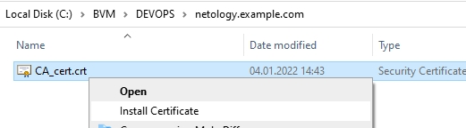

[2](https://github.com/bvmspb/devops-netology/blob/main/pcs-devsys-diplom/diplom_05_02.jpg):

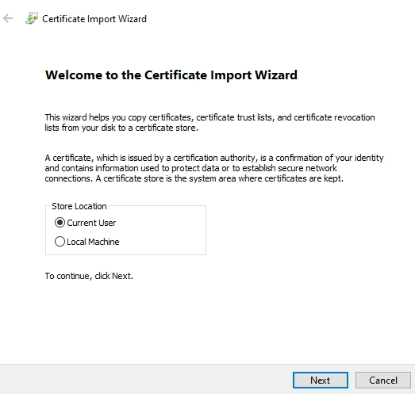

[3](https://github.com/bvmspb/devops-netology/blob/main/pcs-devsys-diplom/diplom_05_03.jpg):

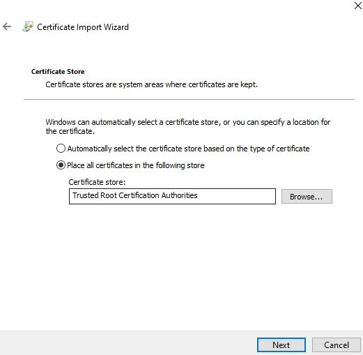

[4](https://github.com/bvmspb/devops-netology/blob/main/pcs-devsys-diplom/diplom_05_04.jpg):

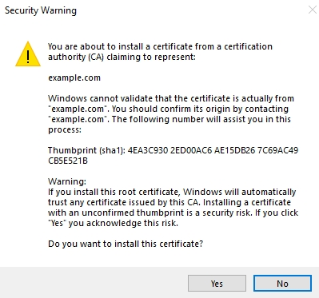

[5](https://github.com/bvmspb/devops-netology/blob/main/pcs-devsys-diplom/diplom_05_05.jpg):

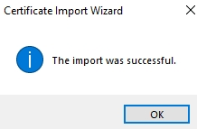

6. Установите nginx.

| Ответ |
| --- |
| Воспользовался инструкцией с сайта nginx (https://nginx.org/en/linux_packages.html#Ubuntu) по добавлению репозитория от авторов с бОльшим приоритетом, чем системный в Ubuntu и установил из него. |

7. По инструкции ([ссылка](https://nginx.org/en/docs/http/configuring_https_servers.html)) настройте nginx на https, используя ранее подготовленный сертификат:
  - можно использовать стандартную стартовую страницу nginx для демонстрации работы сервера;
  - можно использовать и другой html файл, сделанный вами;

```answer
        Использовал стандартный файл /usr/share/nginx/html/index.html, 
        но заменил его содержимое на:
            <!DOCTYPE html>
            <html>
            <body>
            
            <h1>Page Heading</h1>
            <p>Netology test page.</p>
            
            </body>
            </html>
```
```answer
        Использовал стандартный /etc/nginx/nginx.conf, но добавил в нем в http{}:
            ssl_session_cache   shared:SSL:10m;
            ssl_session_timeout 10m;
        А также второй стандартный конфигурацилнный файл /etc/nginx/conf.d/default.conf 
        (который include'ится в основном), в котором в server{} добавил:
            listen       443 ssl;
            server_name  netology.example.com;
            keepalive_timeout   70;
                ssl_certificate     /home/ubuntu/certs/netology.example.com.crt.pem;
                ssl_certificate_key /home/ubuntu/certs/netology.example.com.crt.key;
```

8. Откройте в браузере на хосте https адрес страницы, которую обслуживает сервер nginx.

```answer
        Добавил в c:\windows\system32\etc\hosts запись для данного тестового 
        доменного имени, чтобы обращаться к сайту по имени и не получать 
        ошибку о том, что сертификат выпущен для другого имени (а не ip-адреса).
            130.61.89.43 netology.example.com
```
[1](https://github.com/bvmspb/devops-netology/blob/main/pcs-devsys-diplom/diplom_07_01.jpg):

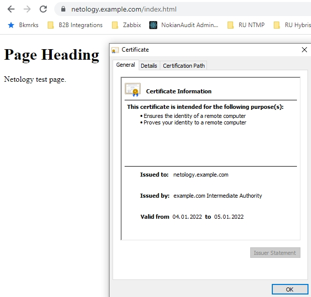

[2](https://github.com/bvmspb/devops-netology/blob/main/pcs-devsys-diplom/diplom_07_02.jpg):

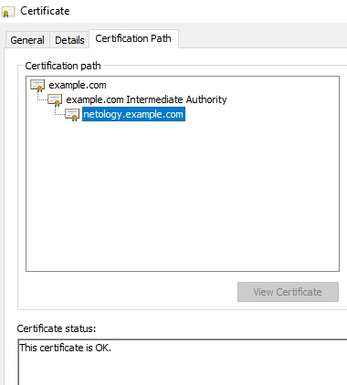


9. Создайте скрипт, который будет генерировать новый сертификат в vault:
  - генерируем новый сертификат так, чтобы не переписывать конфиг nginx;
  - перезапускаем nginx для применения нового сертификата.

```answer
        Создал скрипт, который полностью повторяет последние шаги из четвертого 
        задания. Установил атрибут "исполняемый" (chmod a+x gencert.example.com.sh) 
        и проверил работу - после завершения работы скрипта и обновления страницы в 
        браузере срок действия сертификата изменяется - видно, что подгружается 
        новый сертификат.  
```
[1](https://github.com/bvmspb/devops-netology/blob/main/pcs-devsys-diplom/diplom_09_01.jpg):

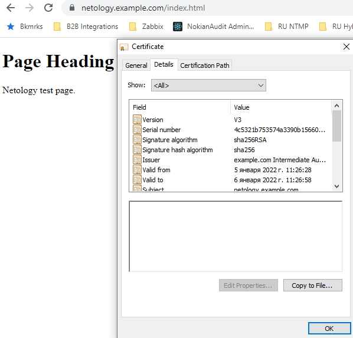

[2](https://github.com/bvmspb/devops-netology/blob/main/pcs-devsys-diplom/diplom_09_02.jpg):

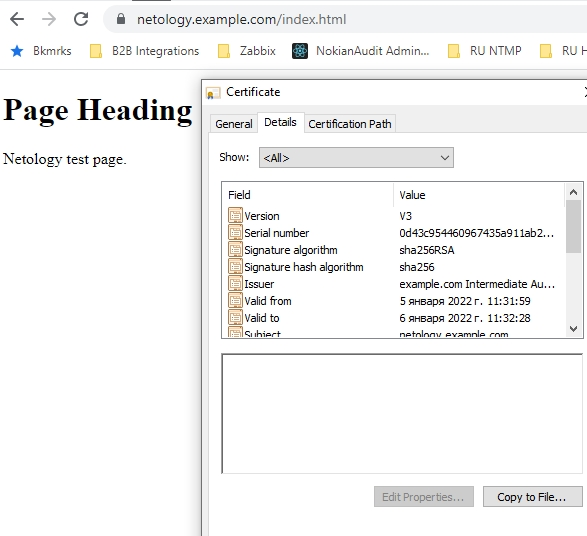

```bash
#!/usr/bin/env bash

export VAULT_ADDR='http://127.0.0.1:8200'
export VAULT_TOKEN=root

vault write pki_int/roles/example-dot-com allowed_domains="example.com" allow_bare_domains=true allow_subdomains=true max_ttl="720h"
vault write -format=json pki_int/issue/example-dot-com common_name="netology.example.com" ttl="24h" >/home/ubuntu/certs/netology.example.com.crt
cat /home/ubuntu/certs/netology.example.com.crt | jq -r '.data.certificate' > /home/ubuntu/certs/netology.example.com.crt.pem
cat /home/ubuntu/certs/netology.example.com.crt | jq -r '.data.issuing_ca' >> /home/ubuntu/certs/netology.example.com.crt.pem
cat /home/ubuntu/certs/netology.example.com.crt | jq -r '.data.private_key' > /home/ubuntu/certs/netology.example.com.crt.key
sudo chmod a+r /home/ubuntu/certs/netology.example.com.crt.pem
sudo chmod a+r /home/ubuntu/certs/netology.example.com.crt.key
sudo systemctl restart nginx

```

10. Поместите скрипт в crontab, чтобы сертификат обновлялся какого-то числа каждого месяца в удобное для вас время.

```answer
        Создал новую диреткорию и скопировал скрипт в нее
             sudo mkdir /opt/certgen/
             cp ./gencert.example.com.sh /opt/certgen/
        
        Добавил в /etc/crontab строку:
            */5 *   * * *   root    /opt/certgen/gencert.example.com.sh
        
        Теперь каждые пять минут должен запускаться скрипт и обновлять 
        сертификат/перезапускать nginx.
```
[1](https://github.com/bvmspb/devops-netology/blob/main/pcs-devsys-diplom/diplom_10_01.jpg):

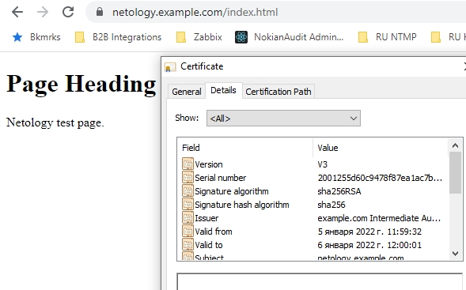

[2](https://github.com/bvmspb/devops-netology/blob/main/pcs-devsys-diplom/diplom_10_02.jpg):

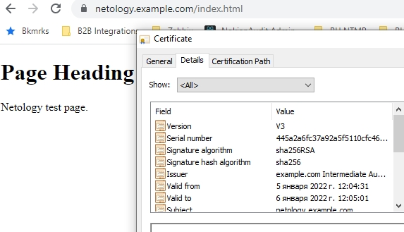

## Результат

Результатом курсовой работы должны быть снимки экрана или текст:

- Процесс установки и настройки ufw
- Процесс установки и выпуска сертификата с помощью hashicorp vault
- Процесс установки и настройки сервера nginx
- Страница сервера nginx в браузере хоста не содержит предупреждений 
- Скрипт генерации нового сертификата работает (сертификат сервера ngnix должен быть "зеленым")
- Crontab работает (выберите число и время так, чтобы показать что crontab запускается и делает что надо)