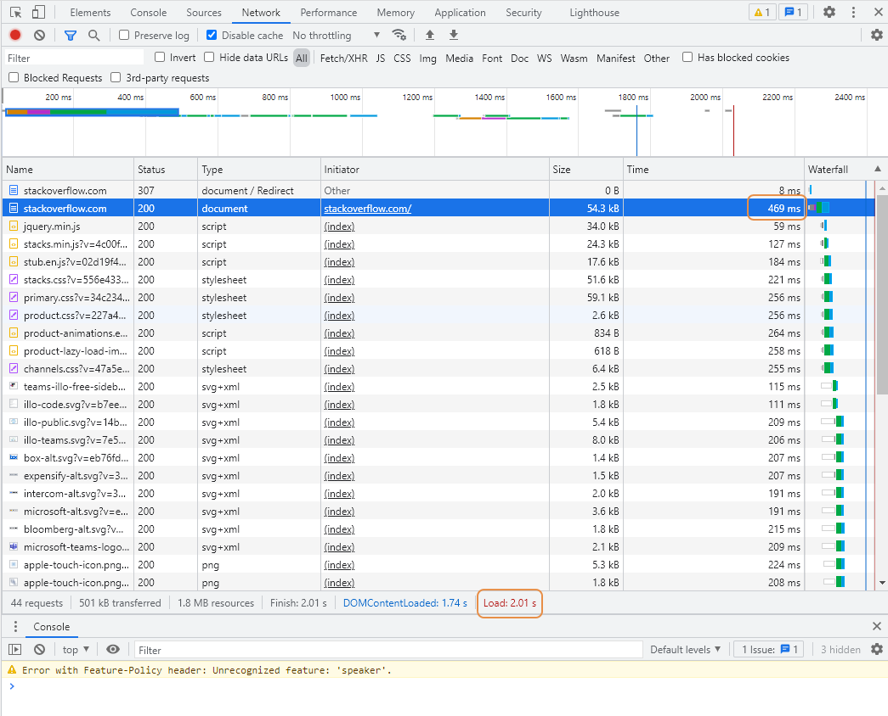
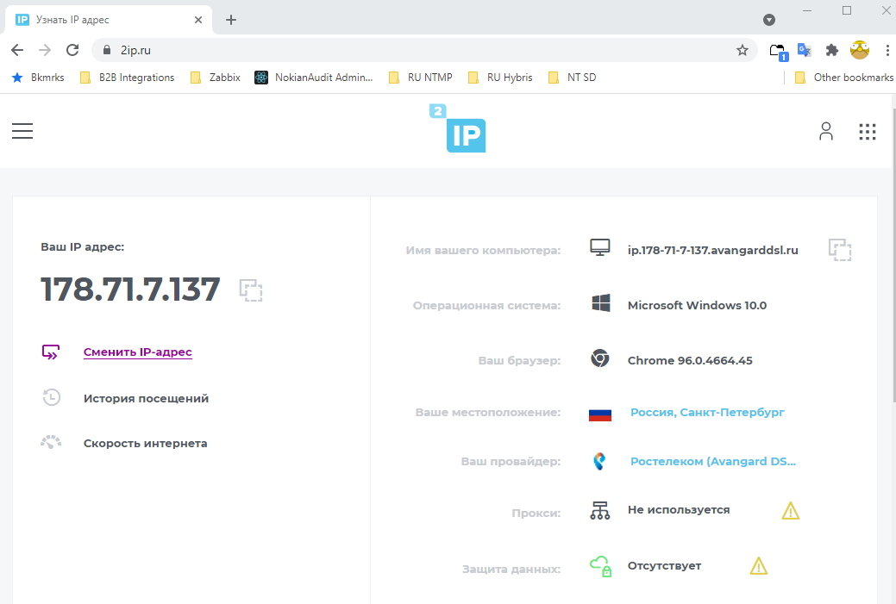
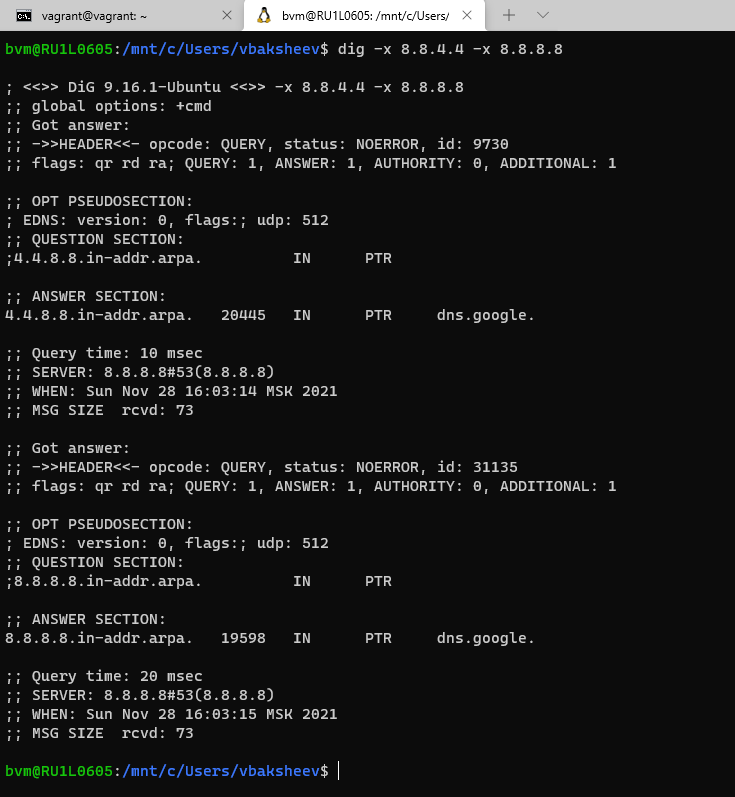

# devops-netology DEVSYS-PDC-2

##Netology, DevOps engineer training 2021-2022. Personal repository of student Baksheev Vladimir

###DEVSYS-PDC-2 sysadmin 03.06 Vladimir Baksheev / Владимир Бакшеев Домашнее задание к занятию «3.6. Компьютерные сети, лекция 1»

# Домашнее задание к занятию "3.6. Компьютерные сети, лекция 1"

1. Работа c HTTP через телнет.
- Подключитесь утилитой телнет к сайту stackoverflow.com
`telnet stackoverflow.com 80`
- отправьте HTTP запрос
```bash
GET /questions HTTP/1.0
HOST: stackoverflow.com
[press enter]
[press enter]
```
- В ответе укажите полученный HTTP код, что он означает?

```answer
        301 - код перенаправления moved permanently/перемещн навсегда, указывает, 
        что запрошенный ресурс был перемещен и необходимо обновить используемые 
        ссылки на новую - которая возвращается в location.
            vagrant@vagrant:~$ telnet stackoverflow.com 80
            Trying 151.101.193.69...
            Connected to stackoverflow.com.
            Escape character is '^]'.
            GET /questions HTTP/1.0
            HOST: stackoverflow.com
            
            HTTP/1.1 301 Moved Permanently 
            cache-control: no-cache, no-store, must-revalidate
            location: https://stackoverflow.com/questions
            ...
```

2. Повторите задание 1 в браузере, используя консоль разработчика F12.
- откройте вкладку `Network`
- отправьте запрос http://stackoverflow.com
- найдите первый ответ HTTP сервера, откройте вкладку `Headers`
- укажите в ответе полученный HTTP код.
- проверьте время загрузки страницы, какой запрос обрабатывался дольше всего?
- приложите скриншот консоли браузера в ответ.

```answer
        307 Internal Redirect - внутренний редирект или временный редирект (Temporary 
        Redirect), используется для указания клиенту о необходимости повторить запрос 
        того же типа (GET в нашем случае) по новому адресу, указанному в location. 
        Временный редирект означает, что информацию о новом адресе не следует 
        кэшировать на стороне клиента.
        
        Дольше всего загружался первый - основной text/html документ, на который как 
        раз и производится редирект - 469ms в моем случае из общего времени загрузки 
        страницы в 2.01s.
        Скриншот из консоли браузера где видны первые файлы, последовательно 
        загружаемые при открытии страницы:
```
[Скриншот](https://github.com/bvmspb/devops-netology/tree/main/images/hw_sa_03_06_02.png): 

3. Какой IP адрес у вас в интернете?

```answer
        178.71.7.137
            vagrant@vagrant:~$ dig TXT +short o-o.myaddr.l.google.com @ns1.google.com
            "178.71.7.137"
```
[2ip.ru](https://github.com/bvmspb/devops-netology/tree/main/images/hw_sa_03_06_03.png): 

4. Какому провайдеру принадлежит ваш IP адрес? Какой автономной системе AS? Воспользуйтесь утилитой `whois`

```answer
        Rostelecom networks, AS12389
        
            vagrant@vagrant:~$ whois 178.71.7.137
            ...
            % Information related to '178.70.0.0/15AS12389'
            
            route:          178.70.0.0/15
            descr:          Rostelecom networks
            origin:         AS12389
            mnt-by:         ROSTELECOM-MNT
            created:        2018-10-31T11:47:01Z
            last-modified:  2018-10-31T11:47:01Z
            source:         RIPE # Filtered
```

5. Через какие сети проходит пакет, отправленный с вашего компьютера на адрес 8.8.8.8? Через какие AS? Воспользуйтесь утилитой `traceroute`

```answer
        За роутером еще пара переходов во внутренних подсетях (у провайдера), далее еще 
        несколько переходов в пределах публичного даресного провайдера провайдера 
        Ростелеком AS12389, после чего уже только попадаем на сетевое оборудование, 
        находящееся в сети Google AS15169 - видны переходы на первых 4 узлах, после чего 
        9 скрытых (запрещен ответ по протоколу ICMP и сразу финальный хоп на требуемый 
        хост с адресом 8.8.8.8 в сети Google AS15169. Последние 9 скрытых переходов 
        сделаны сетевыми инженерами Google, полагаю, намеренно, чтобы не раскрывать 
        какие подсети используются в компании, какие правила маршрутизации трафика, как 
        они могут меняться со временем или в зависимости от географии и т.п.
            bvm@RU1L0605:/mnt/c/Users/vbaksheev$ traceroute -A 8.8.8.8
            traceroute to 8.8.8.8 (8.8.8.8), 30 hops max, 60 byte packets
             1  172.18.144.1 (172.18.144.1) [AS22773]  6.808 ms  6.704 ms  6.664 ms
             2  172.16.0.1 (172.16.0.1) [*]  1.545 ms  1.339 ms  1.537 ms
             3  192.168.100.1 (192.168.100.1) [*]  3.760 ms  2.764 ms  2.731 ms
             4  ppp91-122-108-1.pppoe.avangarddsl.ru (91.122.108.1) [AS12389]  24.071 ms  24.050 ms  24.035 ms
             5  bbn.212-48-204-166.nwtelecom.ru (212.48.204.166) [AS12389]  4.617 ms  7.743 ms  7.729 ms
             6  188.254.2.6 (188.254.2.6) [AS12389]  11.184 ms 188.254.2.4 (188.254.2.4) [AS12389]  8.203 ms  8.181 ms
             7  87.226.194.47 (87.226.194.47) [AS12389]  13.534 ms  11.720 ms  11.705 ms
             8  74.125.244.181 (74.125.244.181) [AS15169]  11.779 ms 74.125.244.133 (74.125.244.133) [AS15169]  13.478 ms 74.125.244.181 (74.125.244.181) [AS15169]  5.336 ms
             9  142.251.51.187 (142.251.51.187) [AS15169]  19.809 ms 142.251.61.221 (142.251.61.221) [AS15169]  19.620 ms  11.424 ms
            10  172.253.79.115 (172.253.79.115) [AS15169]  12.349 ms 216.239.48.97 (216.239.48.97) [AS15169]  14.439 ms 142.250.56.13 (142.250.56.13) [AS15169]  12.233 ms
            11  * 216.239.62.9 (216.239.62.9) [AS15169]  12.175 ms 142.250.56.129 (142.250.56.129) [AS15169]  12.157 ms
            12  * * *
            13  * * *
            14  * * *
            15  * * *
            16  * * *
            17  * * *
            18  * * *
            19  * * *
            20  * * *
            21  dns.google (8.8.8.8) [AS15169]  9.229 ms  9.544 ms  11.223 ms
```

6. Повторите задание 5 в утилите `mtr`. На каком участке наибольшая задержка - delay?

```answer
        В среднем, задержки тем выше - чем дальше от меня хост, таким образом, 
        максимальные задержки на последнем хосте 8.8.8.8. Но возможны разовые 
        проседания из-за которых худшие (worst) показатели могут быть и у 
        ближних, промежуточных хостов - 8. AS15169  74.125.244.133 со значением 
        156.4ms в моем случае (mtr -z 8.8.8.8):
                                                My traceroute  [v0.93]
            RU1L0605 (172.18.159.98)                                              2021-11-28T15:42:00+0300
            Keys:  Help   Display mode   Restart statistics   Order of fields   quit
                                                                  Packets               Pings
             Host                                               Loss%   Snt   Last   Avg  Best  Wrst StDev
             1. AS???    172.18.144.1                            0.0%   202    0.6   0.4   0.2   1.8   0.2
             2. AS???    172.16.0.1                              0.0%   202    1.7   1.1   0.7   2.9   0.4  
             3. AS???    192.168.100.1                           0.0%   201    1.7   1.5   1.0   5.3   0.5  
             4. AS12389  ppp91-122-108-1.pppoe.avangarddsl.ru    0.0%   201    5.7   7.0   2.1  50.8   8.3  
             5. AS12389  bbn.212-48-204-168.nwtelecom.ru         0.0%   201    2.7   5.3   1.9  38.6   3.6  
             6. AS12389  188.254.2.6                             0.0%   201    7.6   9.1   6.2  20.3   2.0  
             7. AS12389  87.226.194.47                           0.0%   201    9.6  11.3   7.8  83.5   5.9  
             8. AS15169  74.125.244.133                          0.0%   201   11.8  12.8   8.7 156.4  11.8  
             9. AS15169  142.251.61.221                          0.0%   201   14.0  12.4   9.7  19.7   1.7 
            10. AS15169  142.250.209.35                          0.0%   201   11.6  13.0  10.3  22.6   1.6 
            11. (waiting for reply)
            12. (waiting for reply)
            13. (waiting for reply)
            14. (waiting for reply)
            15. (waiting for reply)
            16. (waiting for reply)
            17. AS15169  dns.google                             85.5%   201   15.2  13.6  11.6  15.7   1.3        

```

7. Какие DNS сервера отвечают за доменное имя dns.google? Какие A записи? воспользуйтесь утилитой `dig`

```answer
        ns[1-4].zdns.google. (dig dns.google. NS)
            ;; QUESTION SECTION:
            ;dns.google.                    IN      NS
            
            ;; ANSWER SECTION:
            dns.google.             19126   IN      NS      ns3.zdns.google.
            dns.google.             19126   IN      NS      ns4.zdns.google.
            dns.google.             19126   IN      NS      ns2.zdns.google.
            dns.google.             19126   IN      NS      ns1.zdns.google.        
        8.8.4.4 и 8.8.8.8 (dig dns.google. A):
            ;; QUESTION SECTION:
            ;dns.google.                    IN      A
            
            ;; ANSWER SECTION:
            dns.google.             728     IN      A       8.8.4.4
            dns.google.             728     IN      A       8.8.8.8
```

8. Проверьте PTR записи для IP адресов из задания 7. Какое доменное имя привязано к IP? воспользуйтесь утилитой `dig`

```answer
        (dig -x 8.8.4.4 -x 8.8.8.8):
            ...
            ;; ANSWER SECTION:
            4.4.8.8.in-addr.arpa.   15794   IN      PTR     dns.google.
            ...
            8.8.8.8.in-addr.arpa.   19598   IN      PTR     dns.google.
```
[Скриншот](https://github.com/bvmspb/devops-netology/tree/main/images/hw_sa_03_06_08.png): 

В качестве ответов на вопросы можно приложите лог выполнения команд в консоли или скриншот полученных результатов.
