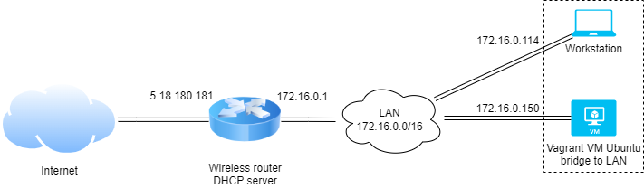

# devops-netology DEVSYS-PDC-2

##Netology, DevOps engineer training 2021-2022. Personal repository of student Baksheev Vladimir

###DEVSYS-PDC-2 sysadmin 03.08 Vladimir Baksheev / Владимир Бакшеев Домашнее задание к занятию «3.8. Компьютерные сети, лекция 3»

# Домашнее задание к занятию "3.8. Компьютерные сети, лекция 3"

Обязательные задания:

1. Подключитесь к публичному маршрутизатору в интернет. Найдите маршрут к вашему публичному IP
```
telnet route-views.routeviews.org
Username: rviews
show ip route x.x.x.x/32
show bgp x.x.x.x/32
```
```answer
        Мой внешний ip: 5.18.180.181
            vagrant@vagrant:~$ dig TXT +short o-o.myaddr.l.google.com @ns1.google.com
            "5.18.180.181"
        
        С данного открытого роутера в мою сеть трафик пойдет через шлюз с 
        адресом 64.71.137.241, информация об этом маршруте была получена по 
        протоколу BGP:
            route-views>show ip route 5.18.180.181
            Routing entry for 5.18.180.0/24
              Known via "bgp 6447", distance 20, metric 0
              Tag 6939, type external
              Last update from 64.71.137.241 7w0d ago
              Routing Descriptor Blocks:
              * 64.71.137.241, from 64.71.137.241, 7w0d ago
                  Route metric is 0, traffic share count is 1
                  AS Hops 3
                  Route tag 6939
                  MPLS label: none
        В таблице BGP много путей (23) к моей подсети:
            route-views>show bgp 5.18.180.181
            BGP routing table entry for 5.18.180.0/24, version 45138220
            Paths: (23 available, best #23, table default)
              Not advertised to any peer
              Refresh Epoch 3
              3303 6939 9049 41733
                217.192.89.50 from 217.192.89.50 (138.187.128.158)
                  Origin IGP, localpref 100, valid, external
                  Community: 3303:1006 3303:1021 3303:1030 3303:3067 6939:7040 6939:8752 6939:9002
                  path 7FE0EA92B128 RPKI State not found
                  rx pathid: 0, tx pathid: 0
            ...
              Refresh Epoch 1
              6939 9049 41733
                64.71.137.241 from 64.71.137.241 (216.218.252.164)
                  Origin IGP, localpref 100, valid, external, best
                  path 7FE03A7F5878 RPKI State not found
                  rx pathid: 0, tx pathid: 0x0
        Но можно отобразить только "лучший маршрут" из таблицы BGP:
            route-views>show ip bgp 5.18.180.0 bestpath
            BGP routing table entry for 5.18.180.0/24, version 45138220
            Paths: (23 available, best #23, table default)
              Not advertised to any peer
              Refresh Epoch 1
              6939 9049 41733
                64.71.137.241 from 64.71.137.241 (216.218.252.164)
                  Origin IGP, localpref 100, valid, external, best
                  path 7FE03A7F5878 RPKI State not found
                  rx pathid: 0, tx pathid: 0x0
```

2. Создайте dummy0 интерфейс в Ubuntu. Добавьте несколько статических маршрутов. Проверьте таблицу маршрутизации.

```answer
        Для работы с dummy интерфейсами необходимо загрузить соответствующий модуль 
        ядра командой (отрабатывает без ошибок и сообщений, значит все Ок):
            vagrant@vagrant:~$ sudo modprobe dummy
            vagrant@vagrant:~$ lsmod | grep dummy
            dummy                  16384  0
        
        Можно добавить новый dummy интерфейс из командной строки:
            vagrant@vagrant:~$ sudo ip link add dummy0 type dummy
        
        Настроить для нового интерфейса ip-адрес:
            vagrant@vagrant:~$ sudo ip addr add 10.2.2.2 dev dummy0
        
        Теперь новый интерфейс доступен в общем списке и отвечает на ping:
            vagrant@vagrant:~$ ip a
            1: lo: <LOOPBACK,UP,LOWER_UP> mtu 65536 qdisc noqueue state UNKNOWN group default qlen 1000
                link/loopback 00:00:00:00:00:00 brd 00:00:00:00:00:00
                inet 127.0.0.1/8 scope host lo
                   valid_lft forever preferred_lft forever
                inet6 ::1/128 scope host
                   valid_lft forever preferred_lft forever
            2: eth0: <BROADCAST,MULTICAST,UP,LOWER_UP> mtu 1500 qdisc fq_codel state UP group default qlen 1000
                link/ether 08:00:27:73:60:cf brd ff:ff:ff:ff:ff:ff
                inet 172.16.0.150/16 brd 172.16.255.255 scope global dynamic eth0
                   valid_lft 6261sec preferred_lft 6261sec
                inet6 fe80::a00:27ff:fe73:60cf/64 scope link
                   valid_lft forever preferred_lft forever
            3: eth0.777@eth0: <BROADCAST,MULTICAST,UP,LOWER_UP> mtu 1500 qdisc noqueue state UP group default qlen 1000
                link/ether 08:00:27:73:60:cf brd ff:ff:ff:ff:ff:ff
                inet 10.0.0.100/24 brd 10.0.0.255 scope global eth0.777
                   valid_lft forever preferred_lft forever
                inet6 fe80::a00:27ff:fe73:60cf/64 scope link
                   valid_lft forever preferred_lft forever
            4: dummy0: <BROADCAST,NOARP,UP,LOWER_UP> mtu 1500 qdisc noqueue state UNKNOWN group default qlen 1000
                link/ether ca:ff:1c:6c:62:f3 brd ff:ff:ff:ff:ff:ff
                inet 10.2.2.2/32 scope global dummy0
                   valid_lft forever preferred_lft forever
                inet6 fe80::c8ff:1cff:fe6c:62f3/64 scope link
                   valid_lft forever preferred_lft forever
            vagrant@vagrant:~$ ping 10.2.2.2
            PING 10.2.2.2 (10.2.2.2) 56(84) bytes of data.
            64 bytes from 10.2.2.2: icmp_seq=1 ttl=64 time=0.048 ms
            64 bytes from 10.2.2.2: icmp_seq=2 ttl=64 time=0.051 ms
            64 bytes from 10.2.2.2: icmp_seq=3 ttl=64 time=0.063 ms
            ^C
            --- 10.2.2.2 ping statistics ---
            3 packets transmitted, 3 received, 0% packet loss, time 2046ms
            rtt min/avg/max/mdev = 0.048/0.054/0.063/0.006 ms
        
        Чтобы dummy интерфейс запускался при загрузке системы необходимо 
        сделать следующее:
            vagrant@vagrant:~$ sudo -i
            root@vagrant:~# echo "dummy" >> /etc/modules
            root@vagrant:~# echo "auto dummy0" >> /etc/network/interfaces
            root@vagrant:~# echo "iface dummy0 inet static" >> /etc/network/interfaces
            root@vagrant:~# echo "    address 10.2.2.2/32" >> /etc/network/interfaces
            root@vagrant:~# echo "    pre-up ip link add dummy0 type dummy" >> /etc/network/interfaces
            root@vagrant:~# echo "    post-down ip link del dummy0" >> /etc/network/interfaces
        
        И можно перезапустить службу сети после изменения этого конфигурационного
        файла:
            root@vagrant:~# systemctl restart networking
        
        Статичные маршруты добавлю при помощи команды ip route add. Для 
        наглядности, как и на уроке, добавлю пару вложенных подсетей, чтобы
        увидеть какой именно маршрут выбрется в том или ином случае. Также
        укажу один из маршрутов с привязкой к конкретному интерфейсу:
            vagrant@vagrant:~$ sudo -i
            root@vagrant:~# ip route add 10.2.2.0/24 via 10.2.2.2 dev dummy0
            root@vagrant:~# ip route add 8.8.0.0/16 via 172.16.0.16
            root@vagrant:~# ip route add 8.8.8.0/24 via 172.16.0.24
            root@vagrant:~# ip route get 8.8.8.8
            8.8.8.8 via 172.16.0.24 dev eth0 src 172.16.0.150 uid 0
                cache
            root@vagrant:~# ip route get 8.8.9.8
            8.8.9.8 via 172.16.0.16 dev eth0 src 172.16.0.150 uid 0
                cache
            root@vagrant:~# ip route get 8.9.9.8
            8.9.9.8 via 172.16.0.1 dev eth0 src 172.16.0.150 uid 0
                cache
        
        Вот все маршруты у меня на компьютере:
            root@vagrant:~# ip route
            default via 172.16.0.1 dev eth0 proto dhcp src 172.16.0.150 metric 100
            8.8.0.0/16 via 172.16.0.16 dev eth0
            8.8.8.0/24 via 172.16.0.24 dev eth0
            10.0.0.0/24 dev eth0.777 proto kernel scope link src 10.0.0.100
            10.2.2.0/24 via 10.2.2.2 dev dummy0
            172.16.0.0/16 dev eth0 proto kernel scope link src 172.16.0.150
            172.16.0.1 dev eth0 proto dhcp scope link src 172.16.0.150 metric 100
```

3. Проверьте открытые TCP порты в Ubuntu, какие протоколы и приложения используют эти порты? Приведите несколько примеров.

```answer
        У меня запущены службы, которые слушают 111 (rpcbind), 53(dns) и 22(SSH) TCP
        порты (при чем как на ip4, так и 6 версии), а также видно, что у меня уже 
        есть активная сесси на 22 порту - установлено входящее подключение к ВМ 
        через SSH (статус established):
            root@vagrant:~# lsof -i TCP -P -n
            COMMAND    PID            USER   FD   TYPE DEVICE SIZE/OFF NODE NAME
            systemd      1            root   35u  IPv4  16563      0t0  TCP *:111 (LISTEN)
            systemd      1            root   37u  IPv6  16567      0t0  TCP *:111 (LISTEN)
            rpcbind    654            _rpc    4u  IPv4  16563      0t0  TCP *:111 (LISTEN)
            rpcbind    654            _rpc    6u  IPv6  16567      0t0  TCP *:111 (LISTEN)
            systemd-r  655 systemd-resolve   13u  IPv4  22273      0t0  TCP 127.0.0.53:53 (LISTEN)
            sshd       897            root    3u  IPv4  23925      0t0  TCP *:22 (LISTEN)
            sshd       897            root    4u  IPv6  23927      0t0  TCP *:22 (LISTEN)
            sshd      1101            root    4u  IPv4  26481      0t0  TCP 172.16.0.150:22->172.16.0.114:53753 (ESTABLISHED)
            sshd      1153         vagrant    4u  IPv4  26481      0t0  TCP 172.16.0.150:22->172.16.0.114:53753 (ESTABLISHED)
        
        Аналогичную информацию об открытых TCP портах можно посмотреть и при 
        помощи команды ss:
            root@vagrant:~# ss -tlpn
            State  Recv-Q Send-Q   Local Address:Port   Peer Address:Port Process
            LISTEN 0      4096           0.0.0.0:111         0.0.0.0:*     users:(("rpcbind",pid=654,fd=4),("systemd",pid=1,fd=35))
            LISTEN 0      4096     127.0.0.53%lo:53          0.0.0.0:*     users:(("systemd-resolve",pid=655,fd=13))
            LISTEN 0      128            0.0.0.0:22          0.0.0.0:*     users:(("sshd",pid=897,fd=3))
            LISTEN 0      4096              [::]:111            [::]:*     users:(("rpcbind",pid=654,fd=6),("systemd",pid=1,fd=37))
            LISTEN 0      128               [::]:22             [::]:*     users:(("sshd",pid=897,fd=4))
        
        Или при помощи netstat:
            root@vagrant:~# netstat -tlpn
            Active Internet connections (only servers)
            Proto Recv-Q Send-Q Local Address           Foreign Address         State       PID/Program name
            tcp        0      0 0.0.0.0:111             0.0.0.0:*               LISTEN      1/init
            tcp        0      0 127.0.0.53:53           0.0.0.0:*               LISTEN      655/systemd-resolve
            tcp        0      0 0.0.0.0:22              0.0.0.0:*               LISTEN      897/sshd: /usr/sbin
            tcp6       0      0 :::111                  :::*                    LISTEN      1/init
            tcp6       0      0 :::22                   :::*                    LISTEN      897/sshd: /usr/sbin
```

4. Проверьте используемые UDP сокеты в Ubuntu, какие протоколы и приложения используют эти порты?

```answer
        В UDP есть небольшие отличия по открытым портам, на которых слушают 
        какие-либо сервисы у меня в ВМ. Помимо DNS(53) и RPCBIND(111) есть еще 
        порт для протокола SNMP (161) и DHCP-клиент (68):
            root@vagrant:~# ss -ulpn
            State  Recv-Q Send-Q     Local Address:Port Peer Address:Port Process
            UNCONN 0      0              127.0.0.1:161       0.0.0.0:*     users:(("snmpd",pid=886,fd=6))
            UNCONN 0      0          127.0.0.53%lo:53        0.0.0.0:*     users:(("systemd-resolve",pid=655,fd=12))
            UNCONN 0      0      172.16.0.150%eth0:68        0.0.0.0:*     users:(("systemd-network",pid=392,fd=19))
            UNCONN 0      0                0.0.0.0:111       0.0.0.0:*     users:(("rpcbind",pid=654,fd=5),("systemd",pid=1,fd=36))
            UNCONN 0      0                  [::1]:161          [::]:*     users:(("snmpd",pid=886,fd=7))
            UNCONN 0      0                   [::]:111          [::]:*     users:(("rpcbind",pid=654,fd=7),("systemd",pid=1,fd=38))
```

5. Используя diagrams.net, создайте L3 диаграмму вашей домашней сети или любой другой сети, с которой вы работали. 

```answer
Нарисовал диаграмму со своим роутером, подключенным к Интернет, ноутбуком и работающей на нем ВМ Ubuntu:
https://github.com/bvmspb/devops-netology/tree/main/images/hw_sa_03_08_05_SimpleLAN_L3_diagram.drawio.png
```
[L3 Диаграмма домашней сети](images/hw_sa_03_08_05_SimpleLAN_L3_diagram.drawio.png): 
 ---