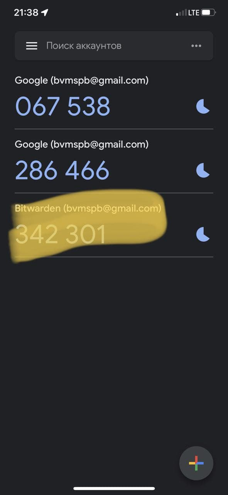
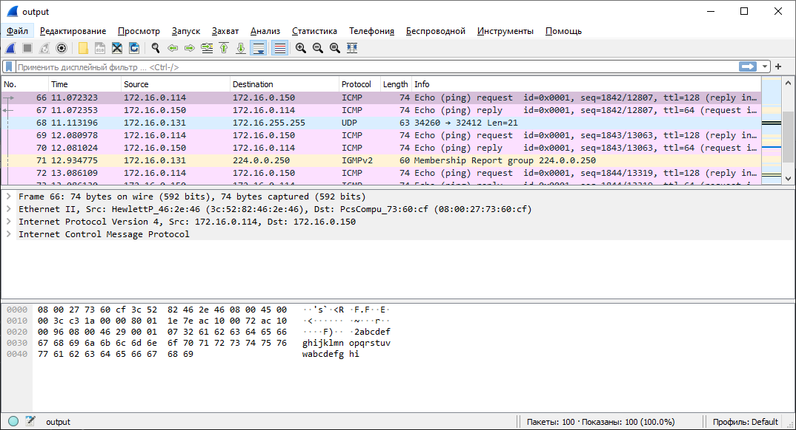

# devops-netology DEVSYS-PDC-2

##Netology, DevOps engineer training 2021-2022. Personal repository of student Baksheev Vladimir

###DEVSYS-PDC-2 sysadmin 03.09 Vladimir Baksheev / Владимир Бакшеев Домашнее задание к занятию «3.9. Элементы безопасности информационных систем»

# Домашнее задание к занятию "3.9. Элементы безопасности информационных систем"

Обязательные задания:

1. Установите Bitwarden плагин для браузера. Зарегестрируйтесь и сохраните несколько паролей.

```answer
        У меня уже был аккаунт Bitwarden, зарегистрированный ранее.
```
[Установлен плагин браузера](images/hw_sa_03_09_01_bitwarden_chrome_plugin.png): 

2. Установите Google authenticator на мобильный телефон. Настройте вход в Bitwarden акаунт через Google authenticator OTP.

```answer
        Настроил как через Google, так и через Microsoft Authenticator, которым чаще приходится пользоваться.
```
[Google Authenticator](images/hw_sa_03_09_01_bitwarden_chrome_plugin.png): 
[Microsoft Authenticator](images/hw_sa_03_09_01_bitwarden_chrome_plugin.png): 

3. Установите apache2, сгенерируйте самоподписанный сертификат, настройте тестовый сайт для работы по HTTPS.

```answer
        Установил по инструкции из презентации к уроку. Дополнительно потребовалось 
        установить (чтобы заработала команда a2enmod:
            vagrant@vagrant:~$ sudo apt install libapache2-mod-wsgi
        
        Далее создал ("выпустил") сертификат:
            vagrant@vagrant:~$ sudo openssl req -x509 -nodes -days 3650 -newkey rsa:2048 \
            > -keyout /etc/ssl/private/apache-selfsigned.key \
            > -out /etc/ssl/certs/apache-selfsigned.crt \
            > -subj "/C=RU/ST=St.Petersburg/L=St.Petersburg/O=Home/OU=Org/CN=172.16.0.150"
            Generating a RSA private key
            .............................+++++
            ...........................+++++
            writing new private key to '/etc/ssl/private/apache-selfsigned.key'
        
        Также по инструкции создал конфигурацию сайта для апач:
            vagrant@vagrant:~$ sudo cat /etc/apache2/sites-available/172.16.0.150.conf
            <VirtualHost *:443>
               ServerName 172.16.0.150
               DocumentRoot /var/www/172.16.0.150
            
               SSLEngine on
               SSLCertificateFile /etc/ssl/certs/apache-selfsigned.crt
               SSLCertificateKeyFile /etc/ssl/private/apache-selfsigned.key
            </VirtualHost>
        
        И "заглавную" страницу:
            vagrant@vagrant:~$ sudo cat /var/www/172.16.0.150/index.html
            <h1>Header</h1>
            <p>Hello world</p>
        
        После чего перезапустил апач и проверил со своего компьютера как открывается сайт:
            vagrant@vagrant:~$ sudo apache2ctl configtest
            Syntax OK
            vagrant@vagrant:~$ sudo systemctl reload apache2
            vagrant@vagrant:~$ sudo systemctl restart apache2
```
[Simple site](images/hw_sa_03_09_03_simple_site_with_ss_ssl.png): 

[Cert details](images/hw_sa_03_09_03_ss_ssl_cert_details.png): 

4. Проверьте на TLS уязвимости произвольный сайт в интернете (кроме сайтов МВД, ФСБ, МинОбр, НацБанк, РосКосмос, РосАтом, РосНАНО и любых госкомпаний, объектов КИИ, ВПК ... и тому подобное).

```answer
        Снова спасибо презентации за пошаговую инструкцию для тестирования 
        из командной строки:
            vagrant@vagrant:~$ mkdir testssl
            vagrant@vagrant:~$ cd testssl/
            vagrant@vagrant:~/testssl$ git clone --depth 1 https://github.com/drwetter/testssl.sh.git
            Cloning into 'testssl.sh'...
            remote: Enumerating objects: 100, done.
            remote: Counting objects: 100% (100/100), done.
            remote: Compressing objects: 100% (93/93), done.
            remote: Total 100 (delta 14), reused 41 (delta 6), pack-reused 0
            Receiving objects: 100% (100/100), 8.61 MiB | 2.86 MiB/s, done.
            Resolving deltas: 100% (14/14), done.
            vagrant@vagrant:~/testssl$ cd testssl.sh/
        
        Далее запустил команду, которая довольно долго отрабатывала (конечно 
        по большей части проблем не обнаружено - максимум замечания, что также 
        поддерживаются устаревшие версии протоколов, например).
        При указании доменного имени происходит определение всех его ip-адресов 
        и затем последовательно обращается для проверки к каждому из них.
            vagrant@vagrant:~/testssl/testssl.sh$ ./testssl.sh -p -U yahoo.com

        Также можно воспользоваться одним из многих сайтов, предлагающих сервис 
        проверки работы сайта с SSL/TLS, например:
            https://www.ssllabs.com/ssltest/analyze.html?d=yahoo.com&s=74.6.231.20&hideResults=on&ignoreMismatch=on
```

5. Установите на Ubuntu ssh сервер, сгенерируйте новый приватный ключ. Скопируйте свой публичный ключ на другой сервер. Подключитесь к серверу по SSH-ключу.

```answer
sshd у меня уже стоял и работает (я только так подключаюсь к этой head-less ВМ):
    vagrant@vagrant:~/testssl/testssl.sh$ sudo systemctl status sshd
    ● ssh.service - OpenBSD Secure Shell server
         Loaded: loaded (/lib/systemd/system/ssh.service; enabled; vendor preset: enabled)
         Active: active (running) since Wed 2021-12-08 16:58:57 UTC; 1h 0min ago
           Docs: man:sshd(8)
                 man:sshd_config(5)
       Main PID: 912 (sshd)
          Tasks: 1 (limit: 1071)
         Memory: 5.7M
         CGroup: /system.slice/ssh.service
                 └─912 sshd: /usr/sbin/sshd -D [listener] 0 of 10-100 startups
    
    Dec 08 16:58:56 vagrant systemd[1]: Starting OpenBSD Secure Shell server...
    Dec 08 16:58:57 vagrant sshd[912]: Server listening on 0.0.0.0 port 22.
    Dec 08 16:58:57 vagrant sshd[912]: Server listening on :: port 22.
    Dec 08 16:58:57 vagrant systemd[1]: Started OpenBSD Secure Shell server.
    Dec 08 17:02:14 vagrant sshd[1181]: Accepted password for vagrant from 172.16.0.114 port 61873 ssh2
    Dec 08 17:02:14 vagrant sshd[1181]: pam_unix(sshd:session): session opened for user vagrant by (uid=0)

Создал нового пользователя newuser и задал ему пароль для входа:
    vagrant@vagrant:~/testssl/testssl.sh$ sudo useradd -m newuser
    vagrant@vagrant:~/testssl/testssl.sh$ sudo passwd newuser
    New password:
    Retype new password:
    passwd: password updated successfully

Далее в другой ВМ (Ubuntu в WSL) создал пару секретный-открытый ключ:
    bvm@RU1L0605:/mnt/c/Users/vbaksheev/testssh$ ssh-keygen -f private.key -t rsa
    Generating public/private rsa key pair.
    Enter passphrase (empty for no passphrase):
    Enter same passphrase again:
    Your identification has been saved in private.key
    Your public key has been saved in private.key.pub
    The key fingerprint is:
    SHA256:1r3NXT24wPbuhzFw43D0wvJw+m7pjFp9ivjIV24b8UU bvm@RU1L0605
    The key's randomart image is:
    +---[RSA 3072]----+
    |                 |
    |             .   |
    |            o . E|
    |         ..* B.o.|
    |        S .+&oo.+|
    |       .  ..+X+.+|
    |           .==Bo.|
    |        . +.=B+. |
    |         =++*Oo  |
    +----[SHA256]-----+
    bvm@RU1L0605:/mnt/c/Users/vbaksheev/testssh$ ls -l
    total 5
    -rwxrwxrwx 1 bvm bvm 2602 Dec  8 21:27 private.key
    -rwxrwxrwx 1 bvm bvm  566 Dec  8 21:27 private.key.pub

И оттуда же копирую новый открытый ключ на ВМ, доступную по сети:
    bvm@RU1L0605:/mnt/c/Users/vbaksheev/testssh$ ssh-copy-id -i ./private.key.pub newuser@172.16.0.150
    /usr/bin/ssh-copy-id: INFO: Source of key(s) to be installed: "./private.key.pub"
    /usr/bin/ssh-copy-id: INFO: attempting to log in with the new key(s), to filter out any that are already installed
    /usr/bin/ssh-copy-id: INFO: 1 key(s) remain to be installed -- if you are prompted now it is to install the new keys
    newuser@172.16.0.150's password:
    
    Number of key(s) added: 1
    
    Now try logging into the machine, with:   "ssh 'newuser@172.16.0.150'"
    and check to make sure that only the key(s) you wanted were added.

У файла с закрытым ключом должны быть доступные права только для владельца.
В WSL пришлось скопировать ключ в папку /tmp/123/ и задать права там 
чтобы заработало:
    bvm@RU1L0605:/mnt/c/Users/vbaksheev/testssh$ cp private.key /tmp/123/
    bvm@RU1L0605:/mnt/c/Users/vbaksheev/testssh$ ls -la /tmp/123/
    total 12
    drwx------ 2 bvm  bvm  4096 Dec  8 21:35 .
    drwxrwxrwt 3 root root 4096 Dec  8 21:34 ..
    -rwxr-xr-x 1 bvm  bvm  2602 Dec  8 21:35 private.key
    bvm@RU1L0605:/mnt/c/Users/vbaksheev/testssh$ chmod 700 /tmp/123/private.key
    bvm@RU1L0605:/mnt/c/Users/vbaksheev/testssh$ ssh -i /tmp/123/private.key newuser@172.16.0.150
    Welcome to Ubuntu 20.04.2 LTS (GNU/Linux 5.4.0-80-generic x86_64)
    
     * Documentation:  https://help.ubuntu.com
     * Management:     https://landscape.canonical.com
     * Support:        https://ubuntu.com/advantage
    
      System information as of Wed 08 Dec 2021 06:35:47 PM UTC
    
      System load:  0.0               Processes:               128
      Usage of /:   2.7% of 61.31GB   Users logged in:         2
      Memory usage: 21%               IPv4 address for dummy0: 10.2.2.2
      Swap usage:   0%                IPv4 address for eth0:   172.16.0.150
    
    
    This system is built by the Bento project by Chef Software
    More information can be found at https://github.com/chef/bento
    Last login: Wed Dec  8 18:22:39 2021 from 172.16.0.114
```
 
6. Переименуйте файлы ключей из задания 5. Настройте файл конфигурации SSH клиента, так чтобы вход на удаленный сервер осуществлялся по имени сервера.

```
В прошлом пункте я сразу создал ключ с нестандартным именем и перенес его 
в нестандартный каталог, так что сейчас остается настроить конфиг для ssh
и проверить как работает подключение (продолжаю работать из WSL):
    bvm@RU1L0605:~$ cd .ssh/
    bvm@RU1L0605:~/.ssh$ vim config
    bvm@RU1L0605:~/.ssh$ chmod 600 config
    bvm@RU1L0605:~/.ssh$ cat config
    Host vagrant_vm
      HostName 172.16.0.150
      IdentityFile /tmp/123/private.key
      User newuser
    bvm@RU1L0605:~/.ssh$ ssh vagrant_vm
    Welcome to Ubuntu 20.04.2 LTS (GNU/Linux 5.4.0-80-generic x86_64)
    
     * Documentation:  https://help.ubuntu.com
     * Management:     https://landscape.canonical.com
     * Support:        https://ubuntu.com/advantage
    
      System information as of Wed 08 Dec 2021 06:43:24 PM UTC
    
      System load:  0.08              Processes:               131
      Usage of /:   2.7% of 61.31GB   Users logged in:         2
      Memory usage: 22%               IPv4 address for dummy0: 10.2.2.2
      Swap usage:   0%                IPv4 address for eth0:   172.16.0.150
    
    
    This system is built by the Bento project by Chef Software
    More information can be found at https://github.com/chef/bento
    Last login: Wed Dec  8 18:35:48 2021 from 172.16.0.114
```

7. Соберите дамп трафика утилитой tcpdump в формате pcap, 100 пакетов. Откройте файл pcap в Wireshark.

```answer
Утилита уже стояла в моей ВМ vagrant. Собрал данные и скопировал в общую 
директорию командой:
    vagrant@vagrant:/vagrant_data/tcpdump_data$ sudo tcpdump -c 100 -w ~/output
    tcpdump: listening on eth0, link-type EN10MB (Ethernet), capture size 262144 bytes
    100 packets captured
    104 packets received by filter
    0 packets dropped by kernel
    vagrant@vagrant:/vagrant_data/tcpdump_data$ cp ~/output /vagrant_data/

Во время "сбора данных" я попинговал свою ВМ извне и это отразилось в числе 
прочего в программе Wireshark.
```
[Wireshark](images/hw_sa_03_09_07_Wireshark.png): 

