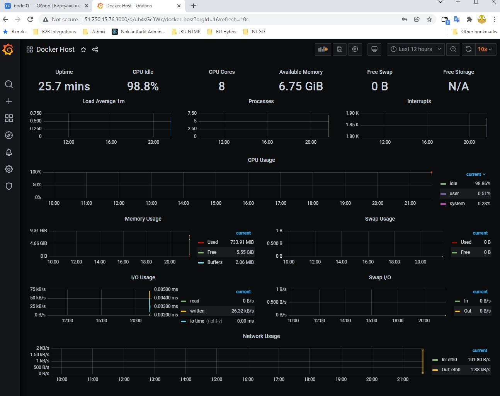

# devops-netology DEVSYS-PDC-2

### DEVSYS-PDC-2 sysadmin 05.04 Vladimir Baksheev / Владимир Бакшеев Домашнее задание к занятию «5.4. Оркестрация группой Docker контейнеров на примере Docker Compose»

# Домашнее задание к занятию "5.4. Оркестрация группой Docker контейнеров на примере Docker Compose"

---

## Задача 1

Создать собственный образ операционной системы с помощью Packer.

Для получения зачета, вам необходимо предоставить:
- Скриншот страницы, как на слайде из презентации (слайд 37).

```answer1
Связал свой yandex аккаунт с сервисом YC, а также активировал триальный 
коммерческий период с депозитом 1000 рублей на 60 дней.
yc CLI установил по инструкции с сайта YC. Проинициализировал и 
создал новый каталог netology для наших экспериментов. Далее создал
сеть и подсеть по примеру из материалов к леции.

Изначально packer установил из стандартного репозитория Ubuntu 
(в wsl2), но там была старая версия, которая еще не умеет работать с 
YC - пришлось по инструкции с сайта YC добавить новый репозиторий и 
установить последниюю версию приложения напрямую от авторов.
```
```bash
bvm@RU1L0605:~/hw05_04$ yc vpc network create --name net --labels my-label=netology --description "my first network via yc"
id: enpd620k8dm2b6ma6dgb
folder_id: b1g820ec2ogqkgji6pgb
created_at: "2022-01-30T17:11:32Z"
name: net
description: my first network via yc
labels:
my-label: netology
bvm@RU1L0605:~/hw05_04$ yc vpc subnet create --name my-subnet-a --zone ru-central1-a --range 10.1.2.0/24 --network-name net --description "my first subnet via yc"
id: e9b14adqq9t09icupbii
folder_id: b1g820ec2ogqkgji6pgb
created_at: "2022-01-30T17:17:57Z"
name: my-subnet-a
description: my first subnet via yc
network_id: enpd620k8dm2b6ma6dgb
zone_id: ru-central1-a
v4_cidr_blocks:
- 10.1.2.0/24
bvm@RU1L0605:~/hw05_04/packer$ packer build centos-7-base.json
yandex: output will be in this color.

==> yandex: Creating temporary RSA SSH key for instance...
==> yandex: Using as source image: fd8ksb92cu689husemj7 (name: "centos-7-v20220124", family: "centos-7")
==> yandex: Use provided subnet id e9b14adqq9t09icupbii
==> yandex: Creating disk...
==> yandex: Creating instance...
==> yandex: Waiting for instance with id fhmui3um168ps46l1n3f to become active...
    yandex: Detected instance IP: 84.252.128.192
==> yandex: Using SSH communicator to connect: 84.252.128.192

[...]

bvm@RU1L0605:~/hw05_04/packer$ packer build centos-7-base.json
yandex: output will be in this color.

==> yandex: Creating temporary RSA SSH key for instance...
==> yandex: Using as source image: fd8ksb92cu689husemj7 (name: "centos-7-v20220124", family: "centos-7")
==> yandex: Use provided subnet id e9b14adqq9t09icupbii
==> yandex: Creating disk...
==> yandex: Creating instance...
==> yandex: Waiting for instance with id fhmui3um168ps46l1n3f to become active...
    yandex: Detected instance IP: 84.252.128.192
==> yandex: Using SSH communicator to connect: 84.252.128.192

[...]

    yandex: Disk has been deleted!
Build 'yandex' finished after 2 minutes 11 seconds.

==> Wait completed after 2 minutes 11 seconds

==> Builds finished. The artifacts of successful builds are:
--> yandex: A disk image was created: centos-7-base (id: fd88558jgmhg1b9iqk0i) with family name centos
bvm@RU1L0605:~/hw05_04/packer$ yc compute image list
+----------------------+---------------+--------+----------------------+--------+
|          ID          |     NAME      | FAMILY |     PRODUCT IDS      | STATUS |
+----------------------+---------------+--------+----------------------+--------+
| fd88558jgmhg1b9iqk0i | centos-7-base | centos | f2e6u62hbpkah20ftmhi | READY  |
+----------------------+---------------+--------+----------------------+--------+
```

[Скриншот](https://github.com/bvmspb/devops-netology/tree/main/images/hw_virt_05_04_01_01.jpg): 

## Задача 2

Создать вашу первую виртуальную машину в Яндекс.Облаке.

Для получения зачета, вам необходимо предоставить:
- Скриншот страницы свойств созданной ВМ, как на примере ниже:

<p align="center">
  
</p>

```answer2
Воспользовался пошаговой инструкцией из материалов к лекции и также 
всем описанием "инфраструктуры как код" из репозитория с домашним 
заданием.
Для установки terraform также добавил репозиторий авторов (Hashicorp) 
и установил последнюю версию напрямую от авторов.
Для авторизации на сервисе terraform будет использовать так называемый 
сервисный аккаунт, отсылку на ключ для которого увидел в файле 
provider.tf
По инструкции из https://cloud.yandex.ru/docs/cli/operations/authentication/service-account
создал сервисный аккаунт, назначил ему роль admin и сгенерировал для 
него ключ.
Также при первом запуске terraform apply получил ошибку ограничения на 
доступную только одну сеть - удалил созданную вручную ранее сеть с 
подсетью и скрипт смог успешно отработать - создать новую ВМ.
После успешного создания и запуска ВМ запустил отрадикторовал inventory 
файл и запустил ansible playbook для получения законченного набора 
мониторинговых сервисов на новой запущенной ВМ. 
```
```bash
bvm@RU1L0605:~/hw05_04/packer$ terraform --version
Terraform v1.1.4
on linux_amd64
bvm@RU1L0605:~/hw05_04/terraform$ yc iam service-account --folder-id b1g820ec2ogqkgji6pgb list
+----+------+
| ID | NAME |
+----+------+
+----+------+

bvm@RU1L0605:~/hw05_04/terraform$ yc iam service-account create --name yandex --description "service account to folder b1g820ec2ogqkgji6pgb"
id: ajekse7hkcingr863k73
folder_id: b1g820ec2ogqkgji6pgb
created_at: "2022-01-30T17:56:07.555545889Z"
name: yandex
description: service account to folder b1g820ec2ogqkgji6pgb 
bvm@RU1L0605:~/hw05_04/terraform$ yc iam service-account get yandex
id: ajekse7hkcingr863k73
folder_id: b1g820ec2ogqkgji6pgb
created_at: "2022-01-30T17:56:07Z"
name: yandex
description: service account to folder b1g820ec2ogqkgji6pgb

bvm@RU1L0605:~/hw05_04/terraform$ yc resource-manager folder add-access-binding netology --role admin --subject serviceAccount:ajekse7hkcingr863k73
done (1s)
bvm@RU1L0605:~/hw05_04/terraform$ yc iam service-account --folder-id b1g820ec2ogqkgji6pgb list
+----------------------+--------+
|          ID          |  NAME  |
+----------------------+--------+
| ajekse7hkcingr863k73 | yandex |
+----------------------+--------+

bvm@RU1L0605:~/hw05_04/terraform$ yc iam key create --service-account-name yandex --output key.json
id: ajef4pfn7tah8e0ha07r
service_account_id: ajekse7hkcingr863k73
created_at: "2022-01-30T18:04:49.832028666Z"
key_algorithm: RSA_2048
```
```bash
bvm@RU1L0605:~/hw05_04/terraform$ terraform init

Initializing the backend...

Initializing provider plugins...
- Finding latest version of yandex-cloud/yandex...
- Installing yandex-cloud/yandex v0.70.0...
- Installed yandex-cloud/yandex v0.70.0 (self-signed, key ID E40F590B50BB8E40)

Partner and community providers are signed by their developers.
If you'd like to know more about provider signing, you can read about it here:
https://www.terraform.io/docs/cli/plugins/signing.html

Terraform has created a lock file .terraform.lock.hcl to record the provider
selections it made above. Include this file in your version control repository
so that Terraform can guarantee to make the same selections by default when
you run "terraform init" in the future.

Terraform has been successfully initialized!

You may now begin working with Terraform. Try running "terraform plan" to see
any changes that are required for your infrastructure. All Terraform commands
should now work.

If you ever set or change modules or backend configuration for Terraform,
rerun this command to reinitialize your working directory. If you forget, other
commands will detect it and remind you to do so if necessary.
bvm@RU1L0605:~/hw05_04/terraform$ terraform plan

Terraform used the selected providers to generate the following execution plan. Resource actions are indicated with the following symbols:
  + create

Terraform will perform the following actions:

  # yandex_compute_instance.node01 will be created
  
[...]

Plan: 3 to add, 0 to change, 0 to destroy.

Changes to Outputs:
  + external_ip_address_node01_yandex_cloud = (known after apply)
  + internal_ip_address_node01_yandex_cloud = (known after apply)

───────────────────────────────────────────────────────────────────────────────────────────────────────────────────────────────────────────────────────────────────────────

Note: You didn't use the -out option to save this plan, so Terraform can't guarantee to take exactly these actions if you run "terraform apply" now.
```
```bash
bvm@RU1L0605:~/hw05_04/terraform$ terraform apply

Terraform used the selected providers to generate the following execution plan. Resource actions are indicated with the following symbols:
  + create

Terraform will perform the following actions:

  # yandex_compute_instance.node01 will be created

[...]

Apply complete! Resources: 3 added, 0 changed, 0 destroyed.

Outputs:

external_ip_address_node01_yandex_cloud = "51.250.15.76"
internal_ip_address_node01_yandex_cloud = "192.168.101.8"
bvm@RU1L0605:~/hw05_04/terraform$ ssh centos@51.250.15.76
The authenticity of host '51.250.15.76 (51.250.15.76)' can't be established.
ECDSA key fingerprint is SHA256:TDGknBOphssQyZRqJ+Y0kZLs7hC6Wooqv5eNO5WZqJw.
Are you sure you want to continue connecting (yes/no/[fingerprint])? yes
Warning: Permanently added '51.250.15.76' (ECDSA) to the list of known hosts.
[centos@node01 ~]$
[centos@node01 ~]$ exit
logout
Connection to 51.250.15.76 closed.
bvm@RU1L0605:~/hw05_04/ansible$ cat inventory
[nodes:children]
manager

[manager]
node01.netology.cloud ansible_host=51.250.15.76
bvm@RU1L0605:~/hw05_04/ansible$ ansible-playbook provision.yml

PLAY [nodes] ***************************************************************************************************************************************************************

TASK [Gathering Facts] *****************************************************************************************************************************************************
ok: [node01.netology.cloud]

TASK [Create directory for ssh-keys] ***************************************************************************************************************************************
ok: [node01.netology.cloud]

[...]

TASK [Up all services in compose] ******************************************************************************************************************************************
changed: [node01.netology.cloud]

PLAY RECAP *****************************************************************************************************************************************************************
node01.netology.cloud      : ok=12   changed=10   unreachable=0    failed=0    skipped=0    rescued=0    ignored=0
```

[Скриншот2](https://github.com/bvmspb/devops-netology/tree/main/images/hw_virt_05_04_02_01.jpg): 

## Задача 3

Создать ваш первый готовый к боевой эксплуатации компонент мониторинга, состоящий из стека микросервисов.

Для получения зачета, вам необходимо предоставить:
- Скриншот работающего веб-интерфейса Grafana с текущими метриками, как на примере ниже
<p align="center">
  
</p>

```answer1
Все шаги по запуску необходимых сервисов вместе с новой ВМ в облаке yc 
выпололнил на этапе выполнения задания 2. 
Сделал скриншоты и ввыполнил команду destroy для terraform.
```
```bash
bvm@RU1L0605:~/hw05_04/terraform$ terraform destroy
yandex_vpc_network.default: Refreshing state... [id=enpb3he6gcgkltnfkgdn]
yandex_vpc_subnet.default: Refreshing state... [id=e9bhg16iri65bu7mtdi2]
yandex_compute_instance.node01: Refreshing state... [id=fhmp1lkm85qccp30ip8c]

Terraform used the selected providers to generate the following execution plan. Resource actions are indicated with the following symbols:
  - destroy

Terraform will perform the following actions:

  # yandex_compute_instance.node01 will be destroyed

[...]

Do you really want to destroy all resources?
  Terraform will destroy all your managed infrastructure, as shown above.
  There is no undo. Only 'yes' will be accepted to confirm.

  Enter a value: yes

yandex_compute_instance.node01: Destroying... [id=fhmp1lkm85qccp30ip8c]
yandex_compute_instance.node01: Still destroying... [id=fhmp1lkm85qccp30ip8c, 10s elapsed]
yandex_compute_instance.node01: Destruction complete after 14s
yandex_vpc_subnet.default: Destroying... [id=e9bhg16iri65bu7mtdi2]
yandex_vpc_subnet.default: Destruction complete after 3s
yandex_vpc_network.default: Destroying... [id=enpb3he6gcgkltnfkgdn]
yandex_vpc_network.default: Destruction complete after 0s

Destroy complete! Resources: 3 destroyed.
```
[Скриншот3.1](https://github.com/bvmspb/devops-netology/tree/main/images/hw_virt_05_04_03_01.jpg): 
[Скриншот3.2](https://github.com/bvmspb/devops-netology/tree/main/images/hw_virt_05_04_03_02.jpg): 

## Задача 4 (*)

Создать вторую ВМ и подключить её к мониторингу развёрнутому на первом сервере.

Для получения зачета, вам необходимо предоставить:
- Скриншот из Grafana, на котором будут отображаться метрики добавленного вами сервера.

