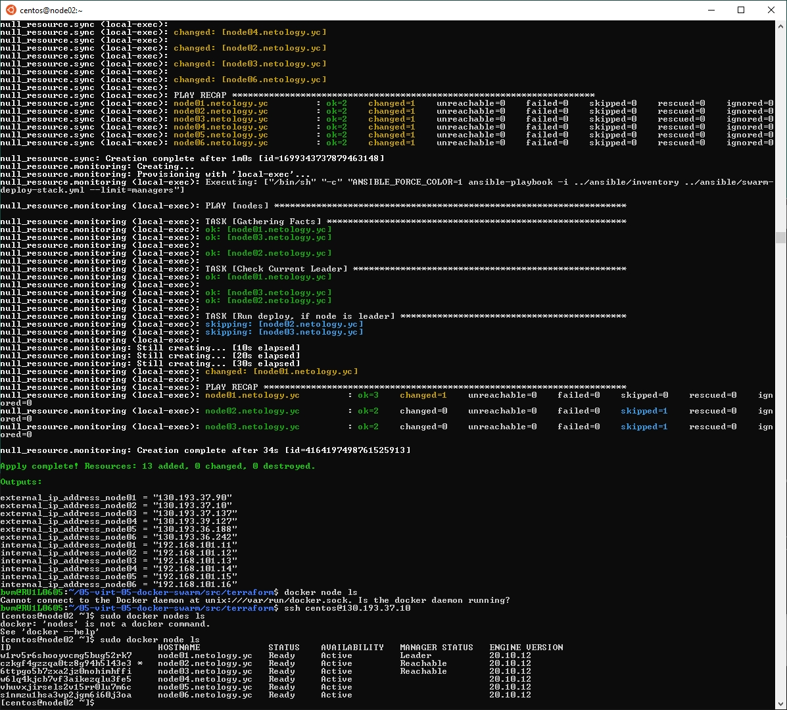
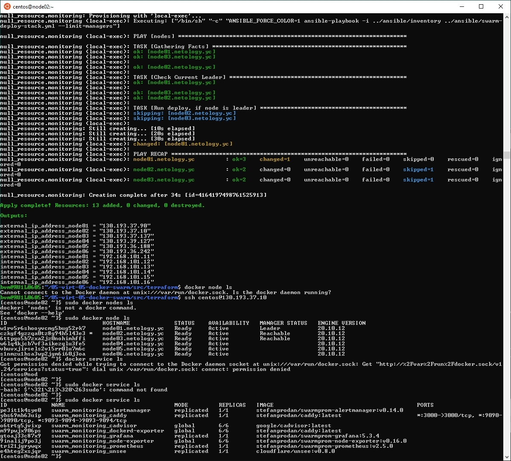
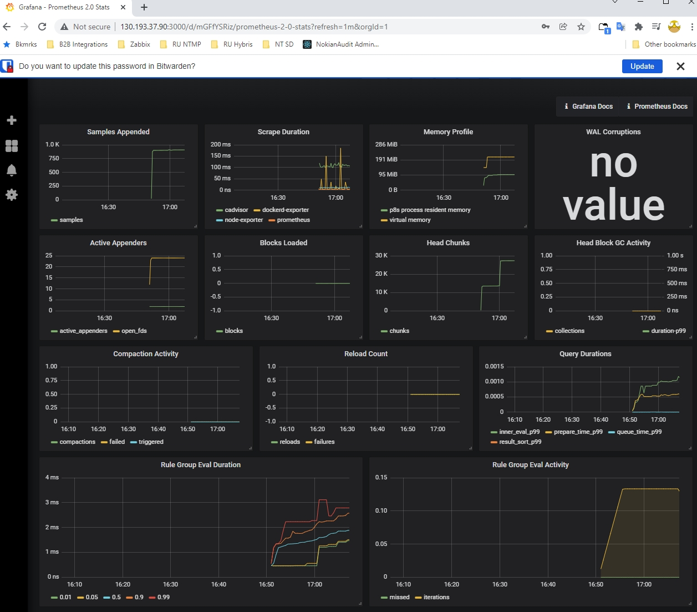
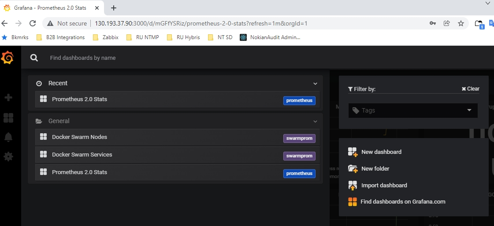
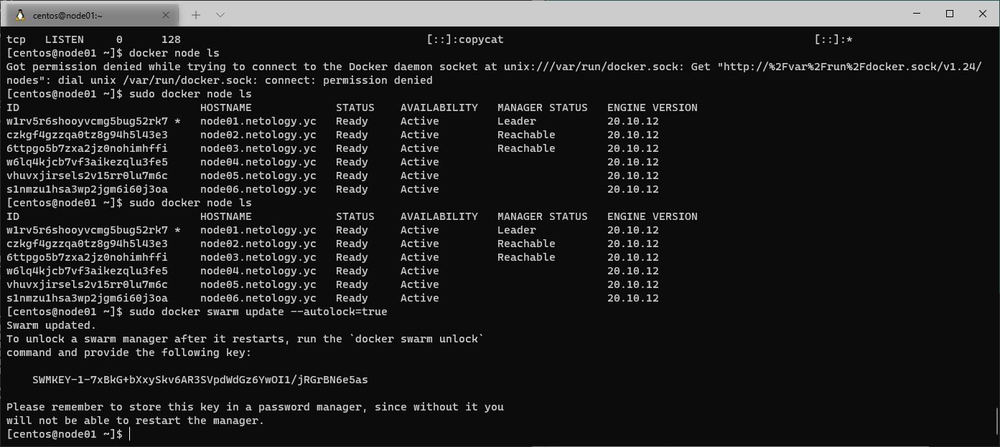

# devops-netology DEVSYS-PDC-2

### DEVSYS-PDC-2 sysadmin 05.05 Vladimir Baksheev / Владимир Бакшеев Домашнее задание к занятию «5.5. Оркестрация кластером Docker контейнеров на примере Docker Swarm»

# Домашнее задание к занятию "5.5. Оркестрация кластером Docker контейнеров на примере Docker Swarm"

---

## Задача 1

Дайте письменые ответы на следующие вопросы:

- В чём отличие режимов работы сервисов в Docker Swarm кластере: replication и global?
- Какой алгоритм выбора лидера используется в Docker Swarm кластере?
- Что такое Overlay Network?

```answer1
- В чём отличие режимов работы сервисов в Docker Swarm кластере: replication и global?

    replication - режим запуска сервиса, при котором указывается 
необходимое количество реплик (копий) данного сервиса, а swarm 
менеджер запланирует запуск сервиса на доступных нодах в swarm. 
Можно указать ограничения вида:
* тип ноды на которой необходимо запустить сервис (менеджеры или коркеры)
* допустимо ли запускать больше одной копии сервиса на каждой ноде
* конкретный хост по имени или id
* платформа/ОС/архитектура
* метки (labels) пользовательские или докера
Доступные ресурсы на ноде также являются ограничителем при выборе ноды 
для запуска очередной реплики

    global - режим запуска сервиса в кластере таким образом, что он будет 
запущен абсолютно на всех нодах кластера - не важно менеджеры это или 
воркеры. Удобно, когда нужно запустить одинаковый сервис на всех 
нодах - например, сервис мониторинга, вотчдог и т.п. и при этом не нужно
прописывать какие-либо дополнительные указатели где запустить такой 
сервис.

- Какой алгоритм выбора лидера используется в Docker Swarm кластере?

    Все взаимодействие в swarm идет только при условии сохранении 
консенсуса, то есть большинство участников должны разделить 
нововведение.
В один момент времени допустимо, чтобы был только один лидер. Любая 
нода из тех, что с ролью Менеджер, может стать лидером, для этого ей 
необходимо:
1) Чтобы истек ее таймер ожидания отклика от текущего лидера, после чего 
такая менеджер нода может стать участником голосования - разослать 
всем остальным менеджерам приглашение принять участие в голосовании 
(отдать свой голос за нее).
2) Стать лидером, если получится собрать большинство голосов от 
других менеджеров в свою пользу.
Голосования происходят по турам и у каждого тура может быть свой 
победитель-лидер. Если часть менеджеров отключится от общей сети и 
отстанет в своем туре выборов от общей сети участников, то, после 
возвращения, они откатят все собственные внутренние изменения и
присоединятся к большинству так как их тур будет меньше, чем у тех, 
что не потеряли связность между собой.
Если две различные ноды одновременно инициируют выборы и получат 
равное количество голосов, то такие выборы будут считаться проваленными 
и лидер определен не будет - следующая менеджер нода с истекшим 
таймером ожидания отклика от лидера сможет инициировать новые выборы 
и, победив, взять на себя роль лидера в новом туре голосования.

- Что такое Overlay Network?

    Overlay network используется для взаимдействия сервисов в swarm между 
собой. После создания overlay сети в swarm режиме все ноды менеджеры 
имеют доступ к этой сети по умолчанию, а при запуске сервисов в swarm 
можно указать им доступ к такой overlay сети, либо добавить его позднее 
при помощи команды вида:
docker service update --network-add my-network my-web
Доступ к такой созданной overlay сети есть только у хостов участников 
swarm (scope: swarm).
```

## Задача 2

Создать ваш первый Docker Swarm кластер в Яндекс.Облаке

Для получения зачета, вам необходимо предоставить скриншот из терминала (консоли), с выводом команды:
```
docker node ls
```

```answer2
        Скопировал подготовленные скрипты и конфигурацию terraform, ansible, 
        packer из репозитория с ДЗ. Исправил id для облака Яндекс, каталога 
        в этом облаке и образа. Образ использовал подготовленный в ходе 
        выполнения прошлого задания 5.4 (так как сам файл для packer'а 
        остался идентичным прошлому - не было необходимости его пересоздавать.
        ТАкже переиспользовал key.json с ключом для сервисного аккаунта - 
        также созданного еще при выполнении ДЗ 5.4
        
        В каталоге terraform последовательно запустил
        terraform init
        terraform validate
        terraform plan
        terraform apply
        
        Пример выполнения скопированный из консоли и скриншот второй 
        (параллельной) консоли ниже.
        
        После выполнения запрошенных команд и снятия скриншотов сразу выполнил
        terraform destroy для удаления всех созданных платных ресурсов.
```

```bash
        Apply complete! Resources: 13 added, 0 changed, 0 destroyed.
        
        Outputs:
        
        external_ip_address_node01 = "130.193.37.90"
        external_ip_address_node02 = "130.193.37.10"
        external_ip_address_node03 = "130.193.37.137"
        external_ip_address_node04 = "130.193.39.127"
        external_ip_address_node05 = "130.193.36.188"
        external_ip_address_node06 = "130.193.36.242"
        internal_ip_address_node01 = "192.168.101.11"
        internal_ip_address_node02 = "192.168.101.12"
        internal_ip_address_node03 = "192.168.101.13"
        internal_ip_address_node04 = "192.168.101.14"
        internal_ip_address_node05 = "192.168.101.15"
        internal_ip_address_node06 = "192.168.101.16"
        bvm@RU1L0605:~/hw05_04/packer$ ssh centos@130.193.37.90
        [centos@node01 ~]$ docker node ls
        Got permission denied while trying to connect to the Docker daemon socket at unix:///var/run/docker.sock: Get "http://%2Fvar%2Frun%2Fdocker.sock/v1.24/nodes": dial unix /var/run/docker.sock: connect: permission denied
        [centos@node01 ~]$ sudo docker node ls
        ID                            HOSTNAME             STATUS    AVAILABILITY   MANAGER STATUS   ENGINE VERSION
        w1rv5r6shooyvcmg5bug52rk7 *   node01.netology.yc   Ready     Active         Leader           20.10.12
        czkgf4gzzqa0tz8g94h5l43e3     node02.netology.yc   Ready     Active         Reachable        20.10.12
        6ttpgo5b7zxa2jz0nohimhffi     node03.netology.yc   Ready     Active         Reachable        20.10.12
        w6lq4kjcb7vf3aikezqlu3fe5     node04.netology.yc   Ready     Active                          20.10.12
        vhuvxjirsels2v15rr0lu7m6c     node05.netology.yc   Ready     Active                          20.10.12
        s1nmzu1hsa3wp2jgm6i60j3oa     node06.netology.yc   Ready     Active                          20.10.12
        [centos@node01 ~]$
```

[Скриншот](https://github.com/bvmspb/devops-netology/tree/main/images/hw_virt_05_05_02_01.jpg): 

## Задача 3

Создать ваш первый, готовый к боевой эксплуатации кластер мониторинга, состоящий из стека микросервисов.

Для получения зачета, вам необходимо предоставить скриншот из терминала (консоли), с выводом команды:
```
docker service ls
```

```bash
        [centos@node02 ~]$ sudo docker service ls
        ID             NAME                                MODE         REPLICAS   IMAGE                                          PORTS
        pe3it1k4sye0   swarm_monitoring_alertmanager       replicated   1/1        stefanprodan/swarmprom-alertmanager:v0.14.0
        ybs69mb63uip   swarm_monitoring_caddy              replicated   1/1        stefanprodan/caddy:latest                      *:3000->3000/tcp, *:9090->9090/tcp, *:9093-9094->9093-9094/tcp
        o6trtg5jvixp   swarm_monitoring_cadvisor           global       6/6        google/cadvisor:latest
        m99pwjx906ps   swarm_monitoring_dockerd-exporter   global       6/6        stefanprodan/caddy:latest
        gtoaj33c87x9   swarm_monitoring_grafana            replicated   1/1        stefanprodan/swarmprom-grafana:5.3.4
        9inalij9po3j   swarm_monitoring_node-exporter      global       6/6        stefanprodan/swarmprom-node-exporter:v0.16.0
        tri21jgrywqx   swarm_monitoring_prometheus         replicated   1/1        stefanprodan/swarmprom-prometheus:v2.5.0
        e4hteg2xsjqr   swarm_monitoring_unsee              replicated   1/1        cloudflare/unsee:v0.8.0
        [centos@node02 ~]$
```

[Скриншот1](https://github.com/bvmspb/devops-netology/tree/main/images/hw_virt_05_05_03_01.jpg): 
[Скриншот2](https://github.com/bvmspb/devops-netology/tree/main/images/hw_virt_05_05_03_02.jpg): 
[Скриншот3](https://github.com/bvmspb/devops-netology/tree/main/images/hw_virt_05_05_03_03.jpg): 

## Задача 4 (*)

Выполнить на лидере Docker Swarm кластера команду (указанную ниже) и дать письменное описание её функционала, что она делает и зачем она нужна:
```
# см.документацию: https://docs.docker.com/engine/swarm/swarm_manager_locking/
docker swarm update --autolock=true
```

```answer4
        Спасибо за интересную ссылку - мало того, что познакомился с безопасным 
        механизмом работы докера с секретами (возможность передавать информацию 
        о паролях, сертификатах, ключах и т.п. в сервисы, запущенные внутри 
        контейнеров докер) - без следов в history и т.п. "открытого" 
        использования в образах или репозиториях, так еще и узнал о том, что 
        внутри swarm взаимодействие происходит в зашифрованном виде, а также 
        логи Raft шифруются тоже. По умолчанию происходит это прозрачным 
        образом и автоматически - при подключении ноды в swarm и рестарте 
        сервиса докер, но можно инициализировать swarm при запуске с параметром 
        (или изменить параметр после начала работы по примеру команды из этого 
        задания) --autolock - в таком случае создается новый токен, который 
        необходимо будет использовать для "распечатывания" swarm на нодах, 
        после перезапуска на них сервиса докер. Если после перезапуска сервиса 
        докер в таком swarm и не разблокировать токеном доступ для такого 
        сервиса докер, то он не получит доступ к сервисам, запущенным в таком 
        swarm, т.к. не сможет начать шифрованный обмен с другими менеджерами в 
        swarm и не сможет расшифровать Raft log. 
```

```bash
        [centos@node01 ~]$ sudo docker swarm update --autolock=true
        Swarm updated.
        To unlock a swarm manager after it restarts, run the `docker swarm unlock`
        command and provide the following key:
        
            SWMKEY-1-7xBkG+bXxySkv6AR3SVpdWdGz6YwOI1/jRGrBN6e5as
        
        Please remember to store this key in a password manager, since without it you
        will not be able to restart the manager.
        [centos@node01 ~]$
```

[Скриншот](https://github.com/bvmspb/devops-netology/tree/main/images/hw_virt_05_05_04_01.jpg): 

