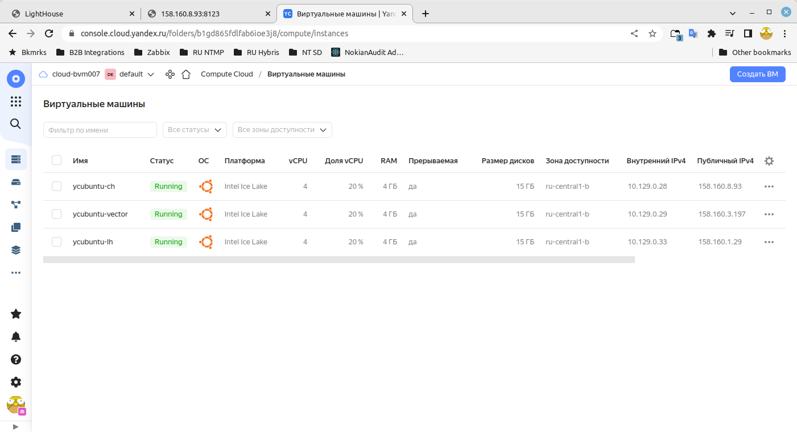
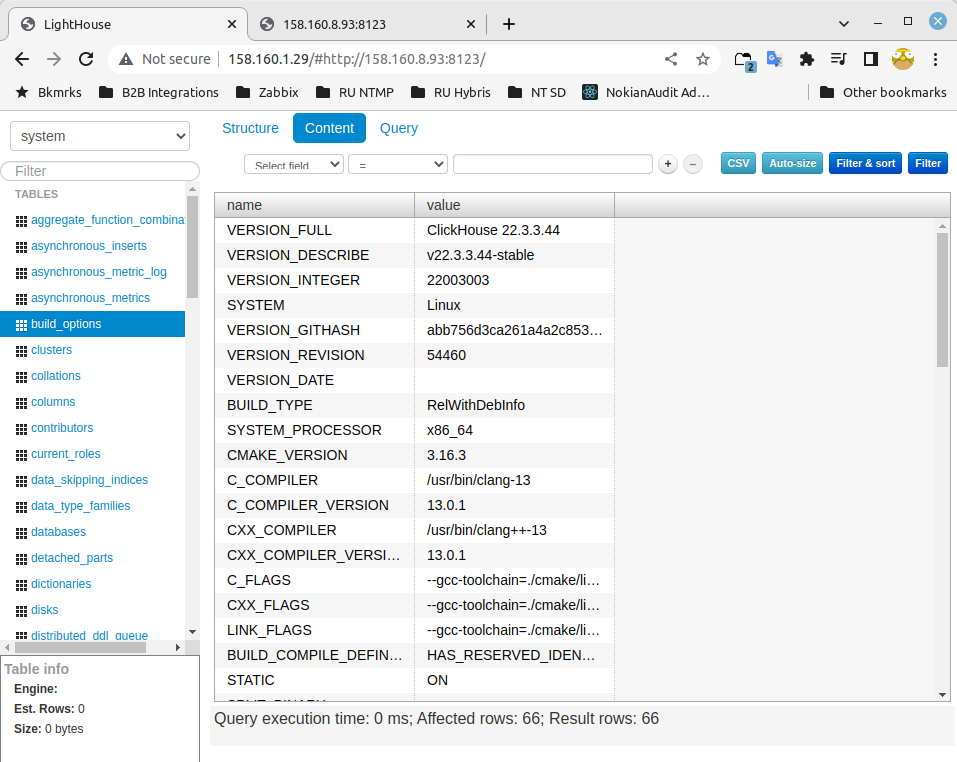
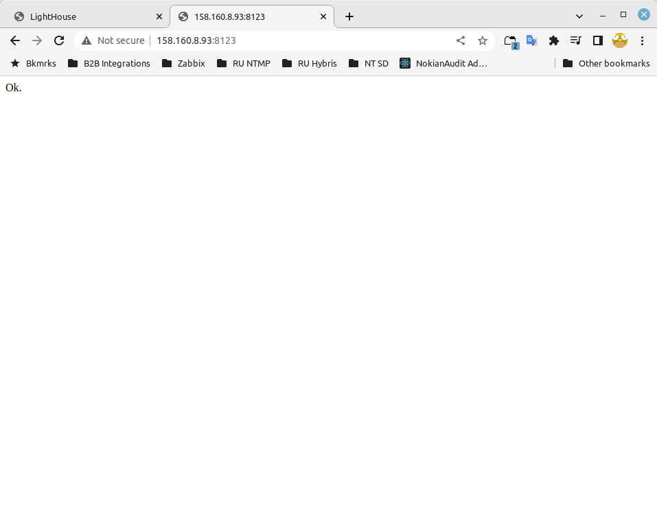

# devops-netology DEVSYS-PDC-2

### DEVSYS-PDC-2 ansible 08.03 Vladimir Baksheev / Владимир Бакшеев Домашнее задание к занятию «08.03 Использование Yandex Cloud»

# Домашнее задание к занятию "08.03 Использование Yandex Cloud"

## Подготовка к выполнению

1. Подготовьте в Yandex Cloud три хоста: для `clickhouse`, для `vector` и для `lighthouse`.

[Скриншот](https://github.com/bvmspb/devops-netology/tree/main/images/hw_ansible_8_3_1_2022-07-11_16-35-24.png): 

## Основная часть

1. Допишите playbook: нужно сделать ещё один play, который устанавливает и настраивает lighthouse.

```answer1
    В итоге есть Play для установки и запуска:
        - Clickhouse
        - Vector
        - nginx
        - lighthouse 
    Отлаживал на localhost, а в последствии изменил имена hosts во всех Play 
    с локальной машины на ВМ в YC и получил работающий стенд там.
```

2. При создании tasks рекомендую использовать модули: `get_url`, `template`, `yum`, `apt`.
3. Tasks должны: скачать статику lighthouse, установить nginx или любой другой webserver, настроить его конфиг для открытия lighthouse, запустить webserver.
4. Приготовьте свой собственный inventory файл `prod.yml`.

```answer4
    Помимо:
        - yc-clickhouse
        - yc-vector
        - yc-lighthouse
    Также использовал "локальные хосты" - оставил в prod.yml, т.к. удобно 
    переключаться при отладке - чтобы не тратить ресурсы в облаке. 
```

5. Запустите `ansible-lint site.yml` и исправьте ошибки, если они есть.

```answer5
Было несколько замечаний на отсутствующий префикс ansible.builtin. - исправлено.
```

6. Попробуйте запустить playbook на этом окружении с флагом `--check`.

```answer6
Сделано
```

7. Запустите playbook на `prod.yml` окружении с флагом `--diff`. Убедитесь, что изменения на системе произведены.

```answer7
Сделано
```

8. Повторно запустите playbook с флагом `--diff` и убедитесь, что playbook идемпотентен.

```answer8
Сделано
```

9. Подготовьте README.md файл по своему playbook. В нём должно быть описано: что делает playbook, какие у него есть параметры и теги.

[README.md](https://github.com/bvmspb/ansible_8_2/blob/08-ansible-03-yandex/README.md)

10. Готовый playbook выложите в свой репозиторий, поставьте тег `08-ansible-03-yandex` на фиксирующий коммит, в ответ предоставьте ссылку на него.

[Repository](https://github.com/bvmspb/ansible_8_2/tree/08-ansible-03-yandex)
[Playbook](https://github.com/bvmspb/ansible_8_2/tree/08-ansible-03-yandex/playbook)
[Tag](https://github.com/bvmspb/ansible_8_2/releases/tag/08-ansible-03-yandex)

[Скриншот1](https://github.com/bvmspb/devops-netology/tree/main/images/hw_ansible_8_3_1_2022-07-11_16-35-24.png): 

[Скриншот2](https://github.com/bvmspb/devops-netology/tree/main/images/hw_ansible_8_3_2_2022-07-11_16-34-56.png): 

[Скриншот3](https://github.com/bvmspb/devops-netology/tree/main/images/hw_ansible_8_3_3_2022-07-11_16-35-02.png): 

---
