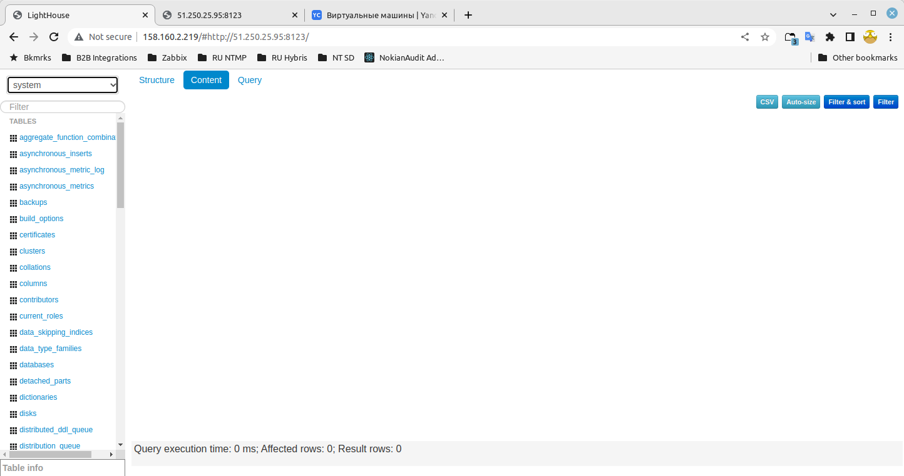
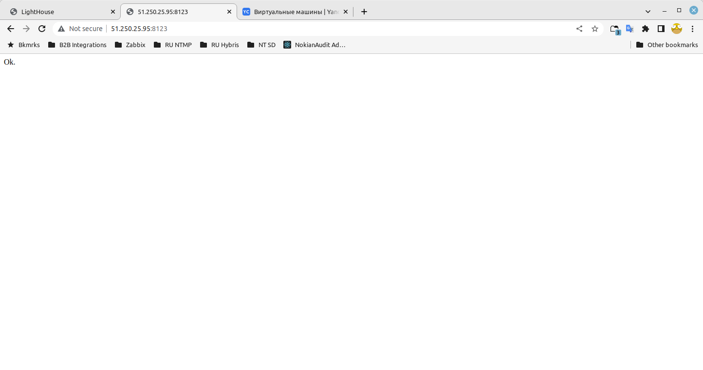
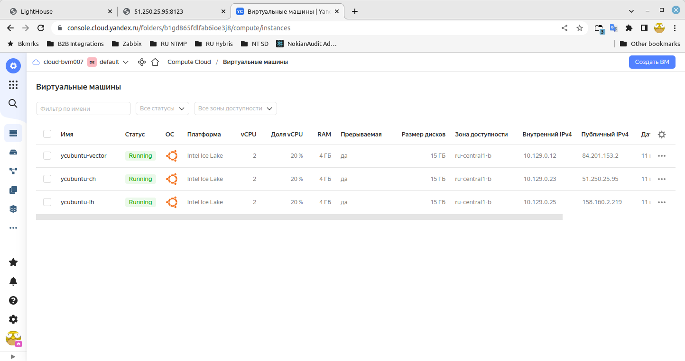

# devops-netology DEVSYS-PDC-2

### DEVSYS-PDC-2 ansible 08.04 Vladimir Baksheev / Владимир Бакшеев Домашнее задание к занятию «8.4 Работа с Roles»

# Домашнее задание к занятию "8.4 Работа с Roles"

## Подготовка к выполнению
1. (Необязательно) Познакомтесь с [lighthouse](https://youtu.be/ymlrNlaHzIY?t=929)
2. Создайте два пустых публичных репозитория в любом своём проекте: vector-role и lighthouse-role.
3. Добавьте публичную часть своего ключа к своему профилю в github.

## Основная часть

Наша основная цель - разбить наш playbook на отдельные roles. Задача: сделать roles для clickhouse, vector и lighthouse и написать playbook для использования этих ролей. Ожидаемый результат: существуют три ваших репозитория: два с roles и один с playbook.

1. Создать в старой версии playbook файл `requirements.yml` и заполнить его следующим содержимым:

   ```yaml
   ---
     - src: git@github.com:AlexeySetevoi/ansible-clickhouse.git
       scm: git
       version: "1.11.0"
       name: clickhouse 
   ```

```answer1
   Сделано.
```

2. При помощи `ansible-galaxy` скачать себе эту роль.

```answer2
   bvm@bvm-HP-EliteBook-8470p:~/netology/ansible_8_2/playbook$ ansible-galaxy role install -r ./requirements.yml -p roles
   Starting galaxy role install process
   - extracting clickhouse to /home/bvm/netology/ansible_8_2/playbook/roles/clickhouse
   - clickhouse (1.11.0) was installed successfully

```

3. Создать новый каталог с ролью при помощи `ansible-galaxy role init vector-role`.

```answer3
   Сделано.
```
```bash
   bvm@bvm-HP-EliteBook-8470p:~/netology$ ansible-galaxy role init vector-role --force
   - Role vector-role was created successfully
   bvm@bvm-HP-EliteBook-8470p:~/netology$ ls -l ./vector-role/
   total 36
   drwxrwxr-x 2 bvm bvm 4096 июл 10 16:00 defaults
   drwxrwxr-x 2 bvm bvm 4096 июл 10 16:00 files
   drwxrwxr-x 2 bvm bvm 4096 июл 10 16:00 handlers
   drwxrwxr-x 2 bvm bvm 4096 июл 10 16:00 meta
   -rw-rw-r-- 1 bvm bvm 1328 июл 10 16:00 README.md
   drwxrwxr-x 2 bvm bvm 4096 июл 10 16:00 tasks
   drwxrwxr-x 2 bvm bvm 4096 июл 10 16:00 templates
   drwxrwxr-x 2 bvm bvm 4096 июл 10 16:00 tests
   drwxrwxr-x 2 bvm bvm 4096 июл 10 16:00 vars

```

4. На основе tasks из старого playbook заполните новую role. Разнесите переменные между `vars` и `default`.

```answer4
   Сделано
```

5. Перенести нужные шаблоны конфигов в `templates`.

```answer5
   Сделано
```

6. Описать в `README.md` обе роли и их параметры.

[lighthouse-role README.md](https://github.com/bvmspb/lighthouse-role/blob/1.0.0/README.md)
[vector-role README.md](https://github.com/bvmspb/vector-role/blob/1.0.1/README.md)

7. Повторите шаги 3-6 для lighthouse. Помните, что одна роль должна настраивать один продукт.

```answer7
   Сделано
```

8. Выложите все roles в репозитории. Проставьте тэги, используя семантическую нумерацию Добавьте roles в `requirements.yml` в playbook.

```answer8
   Сделано
```

9. Переработайте playbook на использование roles. Не забудьте про зависимости lighthouse и возможности совмещения `roles` с `tasks`.

```answer9
   Сделано
```

10. Выложите playbook в репозиторий.
11. В ответ приведите ссылки на оба репозитория с roles и одну ссылку на репозиторий с playbook.

[vector-role Repository](https://github.com/bvmspb/vector-role/tree/1.0.1)
[lighthouse-role Repository](https://github.com/bvmspb/lighthouse-role/tree/1.0.0)
[Playbook Repository](https://github.com/bvmspb/ansible_8_2/tree/08-ansible-04-role/playbook)
[Tag](https://github.com/bvmspb/ansible_8_2/releases/tag/08-ansible-04-role)


[Скриншот1](https://github.com/bvmspb/devops-netology/tree/main/images/hw_ansible_8_4_1_2022-07-11_21-28-17.png): 

[Скриншот2](https://github.com/bvmspb/devops-netology/tree/main/images/hw_ansible_8_4_2_2022-07-11_21-28-24.png): 

[Скриншот3](https://github.com/bvmspb/devops-netology/tree/main/images/hw_ansible_8_4_3_2022-07-11_21-28-29.png): 


---
