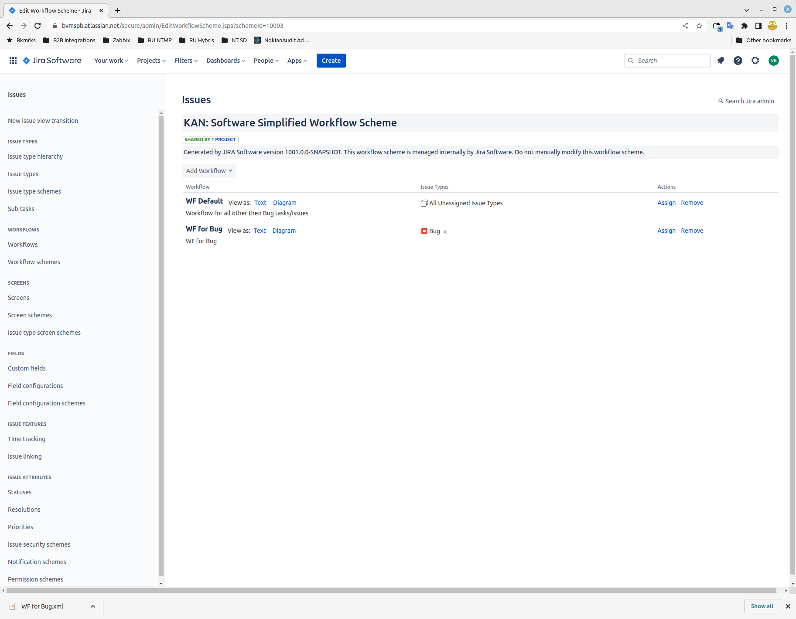
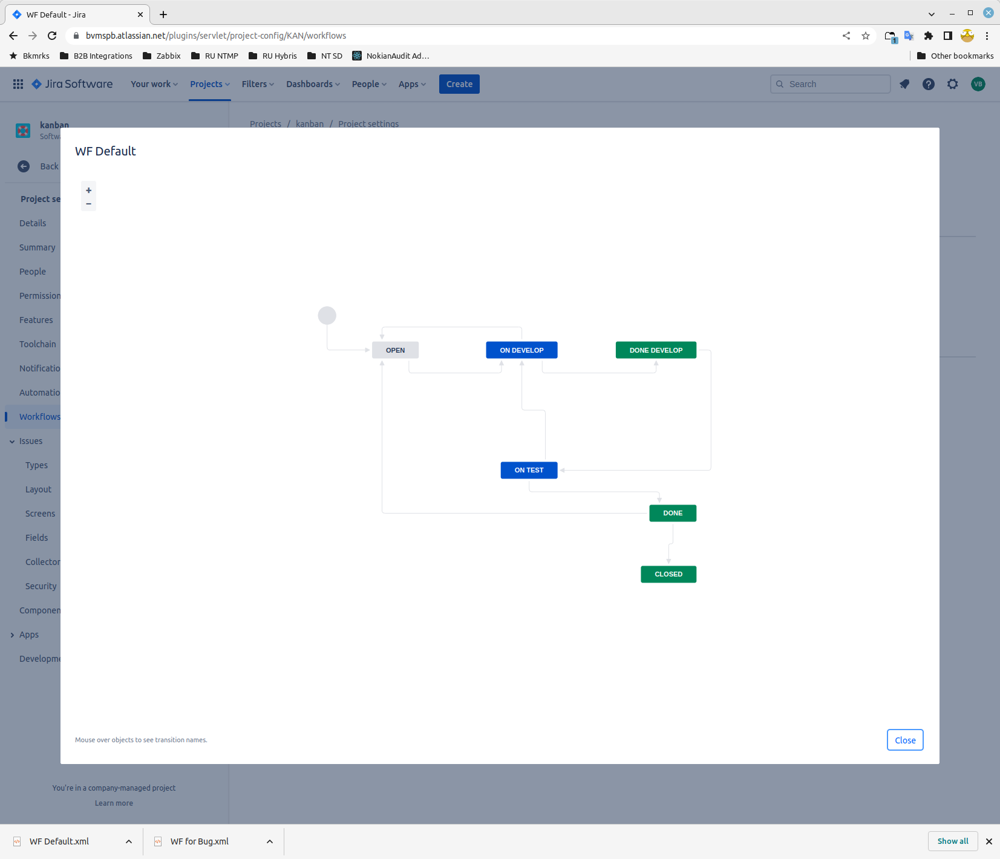
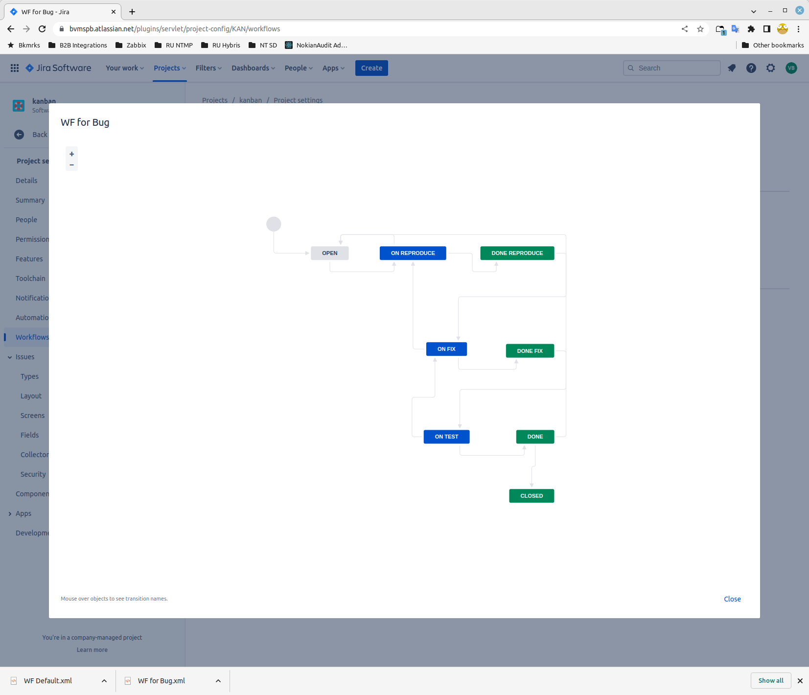
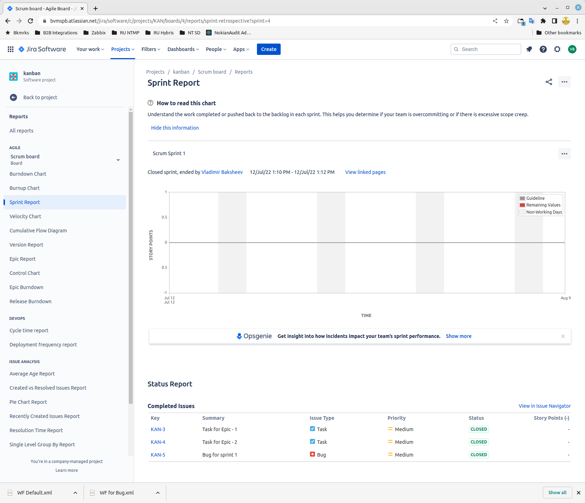

# devops-netology DEVSYS-PDC-2

### DEVSYS-PDC-2 ansible 09.01 Vladimir Baksheev / Владимир Бакшеев Домашнее задание к занятию «09.01 Жизненный цикл ПО»

# Домашнее задание к занятию "09.01 Жизненный цикл ПО"

## Подготовка к выполнению
1. Получить бесплатную [JIRA](https://www.atlassian.com/ru/software/jira/free)

```answer0-1
    В силу обстоятельств - регистрация возможна только при активном VPN 
    подключении/прокси в другой стране, но дальнейшая работа оказалась 
    практически безпроблемной.
```

2. Настроить её для своей "команды разработки"

```answer0-2
    Вот на этом пункте возникла проблема - из-за формулировки в задании про 
    "команды" - изначально создал проект как "team-managed", а не 
    "company-managed" - из-за чего на последнем этапе не смог выгрузить XML 
    для получения зачета по ДЗ. Пришлось начинать сначала.
    На всякий случай вот ссылки на оба проекта:
    1. "team-managed" https://bvmspb.atlassian.net/jira/software/projects/BVMSPB/issues/
    2. "company-managed" https://bvmspb.atlassian.net/jira/software/c/projects/KAN/issues  
```

3. Создать доски kanban и scrum

```answer0-3
    Кстати, также обратил внимание на различия межу "team" и "company" 
    проектами - в первом и канбан и скрам можно настроить в едином 
    навигационном списке слева и переключаться по одному клику, а во 
    втором - требуется именно переключать board. Еще визуализация переходов 
    в workflow в "team-managed" делается чуть более красиво/корректно. 
```

## Основная часть
В рамках основной части необходимо создать собственные workflow для двух типов задач: bug и остальные типы задач. Задачи типа bug должны проходить следующий жизненный цикл:
1. Open -> On reproduce
2. On reproduce -> Open, Done reproduce
3. Done reproduce -> On fix
4. On fix -> On reproduce, Done fix
5. Done fix -> On test
6. On test -> On fix, Done
7. Done -> Closed, Open

Остальные задачи должны проходить по упрощённому workflow:
1. Open -> On develop
2. On develop -> Open, Done develop
3. Done develop -> On test
4. On test -> On develop, Done
5. Done -> Closed, Open

Создать задачу с типом bug, попытаться провести его по всему workflow до Done. Создать задачу с типом epic, к ней привязать несколько задач с типом task, провести их по всему workflow до Done. При проведении обеих задач по статусам использовать kanban. Вернуть задачи в статус Open.
Перейти в scrum, запланировать новый спринт, состоящий из задач эпика и одного бага, стартовать спринт, провести задачи до состояния Closed. Закрыть спринт.

Если всё отработало в рамках ожидания - выгрузить схемы workflow для импорта в XML. Файлы с workflow приложить к решению задания.

[WF Default](https://github.com/bvmspb/devops-netology/tree/main/09_ci_01_intro/WF_Default.xml)

[WF for Bug](https://github.com/bvmspb/devops-netology/tree/main/09_ci_01_intro/09_ci_01_intro/WF_for_Bug.xml)

[Скриншот1](https://github.com/bvmspb/devops-netology/tree/main/images/09_ci_01_intro_1_2022-07-12_15-49-47.png): 

[Скриншот2](https://github.com/bvmspb/devops-netology/tree/main/images/09_ci_01_intro_2_2022-07-12_16-14-11.png): 

[Скриншот3](https://github.com/bvmspb/devops-netology/tree/main/images/09_ci_01_intro_3_2022-07-12_16-14-29.png): 

[Скриншот4](https://github.com/bvmspb/devops-netology/tree/main/images/09_ci_01_intro_4_2022-07-12_16-16-33.png): 


---

