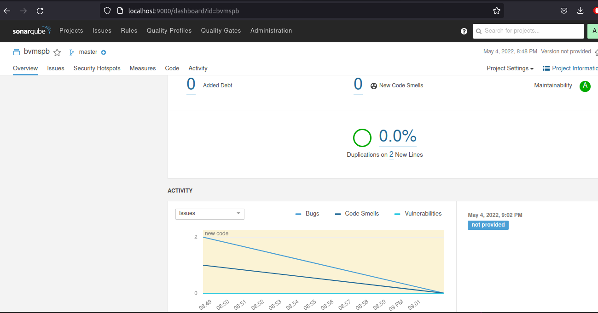

# devops-netology DEVSYS-PDC-2

### DEVSYS-PDC-2 sysadmin 09.02 Vladimir Baksheev / Владимир Бакшеев Домашнее задание к занятию «09.02 CI\CD»

# Домашнее задание к занятию "09.02 CI\CD"

## Знакомоство с SonarQube

### Подготовка к выполнению

1. Выполняем `docker pull sonarqube:8.7-community`

```bash
   bvm@bvm-HP-EliteBook-8470p:~$ sudo docker pull sonarqube:8.7-community
   8.7-community: Pulling from library/sonarqube
   22599d3e9e25: Pull complete 
   00bb4d95f2aa: Pull complete 
   3ef8cf8a60c8: Pull complete 
   928990dd1bda: Pull complete 
   07cca701c22e: Pull complete 
   Digest: sha256:70496f44067bea15514f0a275ee898a7e4a3fedaaa6766e7874d24a39be336dc
   Status: Downloaded newer image for sonarqube:8.7-community
   docker.io/library/sonarqube:8.7-community
```

2. Выполняем `docker run -d --name sonarqube -e SONAR_ES_BOOTSTRAP_CHECKS_DISABLE=true -p 9000:9000 sonarqube:8.7-community`

```bash
   bvm@bvm-HP-EliteBook-8470p:~$ sudo docker run -d --name sonarqube -e SONAR_ES_BOOTSTRAP_CHECKS_DISABLE=true -p 9000:9000 sonarqube:8.7-community
   4eaa7ee41549758cdaf2b514da20b25d2ae1ae45683b44601ee54bab9b8ef5af
```

3. Ждём запуск, смотрим логи через `docker logs -f sonarqube`
4. Проверяем готовность сервиса через [браузер](http://localhost:9000)
5. Заходим под admin\admin, меняем пароль на свой
В целом, в [этой статье](https://docs.sonarqube.org/latest/setup/install-server/) описаны все варианты установки, включая и docker, но так как нам он нужен разово, то достаточно того набора действий, который я указал выше.

```answer
   Sonarqube не удалось запустить на микросервере в облаке - пришлось снова 
   доставать свой ноутбук с Linux, но дальше все зпаустилось и заработало без 
   каких-либо проблем.
```

### Основная часть

1. Создаём новый проект, название произвольное

```answer1.1
   bvmspb
   Также создал токен для него
```

2. Скачиваем пакет sonar-scanner, который нам предлагает скачать сам sonarqube

```answer1.2
   https://docs.sonarqube.org/latest/analysis/scan/sonarscanner/
```

3. Делаем так, чтобы binary был доступен через вызов в shell (или меняем переменную PATH или любой другой удобный вам способ)

```answer1.3
   https://docs.sonarqube.org/latest/analysis/scan/sonarscanner/
```

4. Проверяем `sonar-scanner --version`

```answer1.4
   bvm@bvm-HP-EliteBook-8470p:~$ sonar-scanner --version
   INFO: Scanner configuration file: /opt/sonar-scanner-4.7.0.2747-linux/conf/sonar-scanner.properties
   INFO: Project root configuration file: NONE
   INFO: SonarScanner 4.7.0.2747
   INFO: Java 11.0.14.1 Eclipse Adoptium (64-bit)
   INFO: Linux 5.4.0-109-generic amd64
```
```answer1.4.text
   В файле конфигурации по умолчанию прописал следующие параметры:
   #Configure here general information about the environment, such as SonarQube server connection details for example
   #No information about specific project should appear here
   
   #----- Default SonarQube server
   sonar.host.url=http://localhost:9000
   
   #----- Default source code encoding
   sonar.sourceEncoding=UTF-8
   
   # must be unique in a given SonarQube instance
   sonar.projectKey=bvmspb
   
   # --- optional properties ---
   
   # defaults to project key
   sonar.projectName=bvmspb

```

5. Запускаем анализатор против кода из директории [example](./example) с дополнительным ключом `-Dsonar.coverage.exclusions=fail.py`

```answer1.5
   bvm@bvm-HP-EliteBook-8470p:~/netology/devops-netology/09_ci_02_cicd/example$ sonar-scanner -Dsonar.login=4919a2033ac3bf694a77db43db6754dbfede3bdf -Dsonar.coverage.exclusions=fail.py 
   INFO: Scanner configuration file: /opt/sonar-scanner-4.7.0.2747-linux/conf/sonar-scanner.properties
   INFO: Project root configuration file: NONE
   INFO: SonarScanner 4.7.0.2747
   INFO: Java 11.0.14.1 Eclipse Adoptium (64-bit)
   INFO: Linux 5.4.0-109-generic amd64
   INFO: User cache: /home/bvm/.sonar/cache
   INFO: Scanner configuration file: /opt/sonar-scanner-4.7.0.2747-linux/conf/sonar-scanner.properties
   INFO: Project root configuration file: NONE
   INFO: Analyzing on SonarQube server 8.7.1
   INFO: Default locale: "ru_RU", source code encoding: "UTF-8"
   INFO: Load global settings
   INFO: Load global settings (done) | time=138ms
   INFO: Server id: BF41A1F2-AYCGCJ6WjuVsCTR_vxmP
   INFO: User cache: /home/bvm/.sonar/cache
   INFO: Load/download plugins
   INFO: Load plugins index
   INFO: Load plugins index (done) | time=67ms
   INFO: Load/download plugins (done) | time=1809ms
   INFO: Process project properties
   INFO: Process project properties (done) | time=1ms
   INFO: Execute project builders
   INFO: Execute project builders (done) | time=3ms
   INFO: Project key: bvmspb
   INFO: Base dir: /home/bvm/netology/devops-netology/09_ci_02_cicd/example
   INFO: Working dir: /home/bvm/netology/devops-netology/09_ci_02_cicd/example/.scannerwork
   INFO: Load project settings for component key: 'bvmspb'
   INFO: Load project settings for component key: 'bvmspb' (done) | time=49ms
   INFO: Load quality profiles
   INFO: Load quality profiles (done) | time=148ms
   INFO: Load active rules
   INFO: Load active rules (done) | time=2692ms
   INFO: Indexing files...
   INFO: Project configuration:
   INFO:   Excluded sources for coverage: fail.py
   INFO: 1 file indexed
   INFO: 0 files ignored because of scm ignore settings
   INFO: Quality profile for py: Sonar way
   INFO: ------------- Run sensors on module bvmspb
   INFO: Load metrics repository
   INFO: Load metrics repository (done) | time=128ms
   INFO: Sensor Python Sensor [python]
   INFO: Starting global symbols computation
   INFO: 1 source files to be analyzed
   INFO: Load project repositories
   INFO: Load project repositories (done) | time=60ms
   INFO: Starting rules execution
   INFO: 1/1 source files have been analyzed
   INFO: 1 source files to be analyzed
   INFO: Sensor Python Sensor [python] (done) | time=8602ms
   INFO: Sensor Cobertura Sensor for Python coverage [python]
   INFO: 1/1 source files have been analyzed
   INFO: Sensor Cobertura Sensor for Python coverage [python] (done) | time=10ms
   INFO: Sensor PythonXUnitSensor [python]
   INFO: Sensor PythonXUnitSensor [python] (done) | time=0ms
   INFO: Sensor CSS Rules [cssfamily]
   INFO: No CSS, PHP, HTML or VueJS files are found in the project. CSS analysis is skipped.
   INFO: Sensor CSS Rules [cssfamily] (done) | time=1ms
   INFO: Sensor JaCoCo XML Report Importer [jacoco]
   INFO: 'sonar.coverage.jacoco.xmlReportPaths' is not defined. Using default locations: target/site/jacoco/jacoco.xml,target/site/jacoco-it/jacoco.xml,build/reports/jacoco/test/jacocoTestReport.xml
   INFO: No report imported, no coverage information will be imported by JaCoCo XML Report Importer
   INFO: Sensor JaCoCo XML Report Importer [jacoco] (done) | time=4ms
   INFO: Sensor C# Properties [csharp]
   INFO: Sensor C# Properties [csharp] (done) | time=1ms
   INFO: Sensor JavaXmlSensor [java]
   INFO: Sensor JavaXmlSensor [java] (done) | time=1ms
   INFO: Sensor HTML [web]
   INFO: Sensor HTML [web] (done) | time=3ms
   INFO: Sensor VB.NET Properties [vbnet]
   INFO: Sensor VB.NET Properties [vbnet] (done) | time=1ms
   INFO: ------------- Run sensors on project
   INFO: Sensor Zero Coverage Sensor
   INFO: Sensor Zero Coverage Sensor (done) | time=0ms
   INFO: SCM Publisher SCM provider for this project is: git
   INFO: SCM Publisher 1 source file to be analyzed
   INFO: SCM Publisher 1/1 source file have been analyzed (done) | time=127ms
   INFO: CPD Executor Calculating CPD for 1 file
   INFO: CPD Executor CPD calculation finished (done) | time=9ms
   INFO: Analysis report generated in 99ms, dir size=92 KB
   INFO: Analysis report compressed in 14ms, zip size=12 KB
   INFO: Analysis report uploaded in 55ms
   INFO: ANALYSIS SUCCESSFUL, you can browse http://localhost:9000/dashboard?id=bvmspb
   INFO: Note that you will be able to access the updated dashboard once the server has processed the submitted analysis report
   INFO: More about the report processing at http://localhost:9000/api/ce/task?id=AYCQMKz-juVsCTR_v2lb
   INFO: Analysis total time: 14.877 s
   INFO: ------------------------------------------------------------------------
   INFO: EXECUTION SUCCESS
   INFO: ------------------------------------------------------------------------
   INFO: Total time: 18.558s
   INFO: Final Memory: 7M/34M
   INFO: ------------------------------------------------------------------------
   bvm@bvm-HP-EliteBook-8470p:~/netology/devops-netology/09_ci_02_cicd/example$ 
```

6. Смотрим результат в интерфейсе

[Скриншот](https://github.com/bvmspb/devops-netology/tree/main/images/hw_09_ci_02_01_1.png): 

7. Исправляем ошибки, которые он выявил(включая warnings)

```python
   index = 0
   def increment(index):
       index += 1
       return index
   def get_square(numb):
       return numb*numb
   def print_numb(numb):
       print("Number is {}".format(numb))
   
   index = 0
   while (index < 10):
       index = increment(index)
       print(get_square(index))
```

8. Запускаем анализатор повторно - проверяем, что QG пройдены успешно
9. Делаем скриншот успешного прохождения анализа, прикладываем к решению ДЗ

[Скриншот1](https://github.com/bvmspb/devops-netology/tree/main/images/hw_09_ci_02_01_2.png): 
[Скриншот2](https://github.com/bvmspb/devops-netology/tree/main/images/hw_09_ci_02_01_3.png): 

## Знакомство с Nexus

### Подготовка к выполнению

1. Выполняем `docker pull sonatype/nexus3`

```answer2-1.1
   bvm@bvm-HP-EliteBook-8470p:~/netology/devops-netology$ sudo docker pull sonatype/nexus3
   [sudo] пароль для bvm:     
   Using default tag: latest
   latest: Pulling from sonatype/nexus3
   3de00bb8554b: Pull complete 
   c530010fb61c: Pull complete 
   7702e8da5f17: Pull complete 
   17eb9ed9829d: Pull complete 
   43371288717f: Pull complete 
   Digest: sha256:66fe12b1eb3e97bae72eb3c2c4e436499d41ff144cdfd1dcd0718df738304732
   Status: Downloaded newer image for sonatype/nexus3:latest
   docker.io/sonatype/nexus3:latest
```

2. Выполняем `docker run -d -p 8081:8081 --name nexus sonatype/nexus3`

```answer2-1.2
bvm@bvm-HP-EliteBook-8470p:~/netology/devops-netology$ sudo docker run -d -p 8081:8081 --name nexus sonatype/nexus3
87671783d6c2e4b0974c38a06b3cc79ebdbad48679a9f5964a4b940762770c27
```

3. Ждём запуск, смотрим логи через `docker logs -f nexus`
4. Проверяем готовность сервиса через [бразуер](http://localhost:8081)
5. Узнаём пароль от admin через `docker exec -it nexus /bin/bash`

```answer2-1.5
   bvm@bvm-HP-EliteBook-8470p:~/netology/devops-netology$ sudo docker exec -it nexus /bin/bash
   [sudo] пароль для bvm:     
   bash-4.4$ 
   bash-4.4$ set | grep data
   INSTALL4J_ADD_VM_PARAMS='-Xms2703m -Xmx2703m -XX:MaxDirectMemorySize=2703m -Djava.util.prefs.userRoot=/nexus-data/javaprefs'
   NEXUS_DATA=/nexus-data
   bash-4.4$ cat /nexus-data/
   admin.password       db/                  generated-bundles/   karaf.pid            log/                 restore-from-backup/ 
   blobs/               elasticsearch/       instances/           keystores/           orient/              tmp/                 
   cache/               etc/                 javaprefs/           lock                 port                 
   bash-4.4$ cat /nexus-data/admin.password 
   77cbf455-852f-4f73-b7c5-094b3bb6d3adbash-4.4$ 

```

6. Подключаемся под админом, меняем пароль, сохраняем анонимный доступ

### Основная часть

1. В репозиторий `maven-public` загружаем артефакт с GAV параметрами:
   1. groupId: netology
   2. artifactId: java
   3. version: 8_282
   4. classifier: distrib
   5. type: tar.gz
2. В него же загружаем такой же артефакт, но с version: 8_102
3. Проверяем, что все файлы загрузились успешно

[Скриншот](https://github.com/bvmspb/devops-netology/tree/main/images/hw_09_ci_02_02_1.png): 

4. В ответе присылаем файл `maven-metadata.xml` для этого артефекта

```maven-metadata.xml
<metadata modelVersion="1.1.0">
<groupId>Netology</groupId>
<artifactId>java</artifactId>
<versioning>
<latest>8_282</latest>
<release>8_282</release>
<versions>
<version>8_102</version>
<version>8_282</version>
</versions>
<lastUpdated>20220504191528</lastUpdated>
</versioning>
</metadata>
```

### Знакомство с Maven

### Подготовка к выполнению

1. Скачиваем дистрибутив с [maven](https://maven.apache.org/download.cgi)
2. Разархивируем, делаем так, чтобы binary был доступен через вызов в shell (или меняем переменную PATH или любой другой удобный вам способ)
3. Проверяем `mvn --version`

```answer3.1
bvm@bvm-HP-EliteBook-8470p:~/netology/devops-netology/09_ci_02_cicd/mvn$ export PATH=/opt/apache-maven-3.8.5/bin/:$PATH
bvm@bvm-HP-EliteBook-8470p:~/netology/devops-netology/09_ci_02_cicd/mvn$ mvn --version
Apache Maven 3.8.5 (3599d3414f046de2324203b78ddcf9b5e4388aa0)
Maven home: /opt/apache-maven-3.8.5
Java version: 11.0.15, vendor: Private Build, runtime: /usr/lib/jvm/java-11-openjdk-amd64
Default locale: ru_RU, platform encoding: UTF-8
OS name: "linux", version: "5.4.0-109-generic", arch: "amd64", family: "unix"
```

4. Забираем директорию [mvn](./mvn) с pom

### Основная часть

1. Меняем в `pom.xml` блок с зависимостями под наш артефакт из первого пункта задания для Nexus (java с версией 8_282)
2. Запускаем команду `mvn package` в директории с `pom.xml`, ожидаем успешного окончания
3. Проверяем директорию `~/.m2/repository/`, находим наш артефакт

```answer3.3
[INFO] BUILD SUCCESS
[INFO] ------------------------------------------------------------------------
[INFO] Total time:  12.745 s
[INFO] Finished at: 2022-05-04T22:30:15+03:00
[INFO] ------------------------------------------------------------------------
bvm@bvm-HP-EliteBook-8470p:~/netology/devops-netology/09_ci_02_cicd/mvn$ ls -la target/
итого 16
drwxrwxr-x 3 bvm bvm 4096 мая  4 22:30 .
drwxrwxr-x 3 bvm bvm 4096 мая  4 22:30 ..
drwxrwxr-x 2 bvm bvm 4096 мая  4 22:30 maven-archiver
-rw-rw-r-- 1 bvm bvm 1587 мая  4 22:30 simple-app-1.0-SNAPSHOT.jar
bvm@bvm-HP-EliteBook-8470p:~/netology/devops-netology/09_ci_02_cicd/mvn$ ls -la ~/.m2/repository/Netology/java/8_282/
итого 111432
drwxrwxr-x 2 bvm bvm      4096 мая  4 22:30 .
drwxrwxr-x 3 bvm bvm      4096 мая  4 22:30 ..
-rw-rw-r-- 1 bvm bvm 114078464 мая  4 22:30 java-8_282-distrib.tar.gz
-rw-rw-r-- 1 bvm bvm        40 мая  4 22:30 java-8_282-distrib.tar.gz.sha1
-rw-rw-r-- 1 bvm bvm       382 мая  4 22:30 java-8_282.pom.lastUpdated
-rw-rw-r-- 1 bvm bvm       174 мая  4 22:30 _remote.repositories
```

4. В ответе присылаем исправленный файл `pom.xml`

```pom.xml
<project xmlns="http://maven.apache.org/POM/4.0.0" xmlns:xsi="http://www.w3.org/2001/XMLSchema-instance"
  xsi:schemaLocation="http://maven.apache.org/POM/4.0.0 http://maven.apache.org/xsd/maven-4.0.0.xsd">
  <modelVersion>4.0.0</modelVersion>

  <groupId>com.netology.app</groupId>
  <artifactId>simple-app</artifactId>
  <version>1.0-SNAPSHOT</version>
   <repositories>
    <repository>
      <id>bvmspb</id>
      <name>maven-public</name>
      <url>http://localhost:8081/repository/maven-public/</url>
    </repository>
  </repositories>
  <dependencies>
     <dependency>
      <groupId>Netology</groupId>
      <artifactId>java</artifactId>
      <version>8_282</version>
      <classifier>distrib</classifier>
      <type>tar.gz</type>
    </dependency>
  </dependencies>
</project>
```

---
